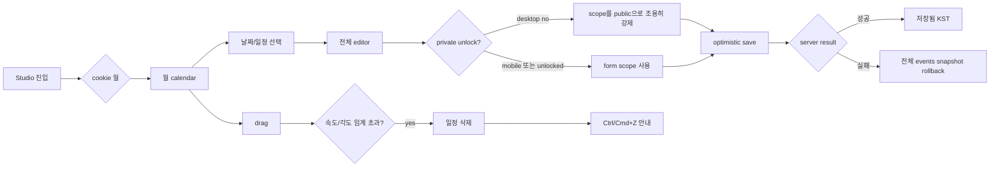
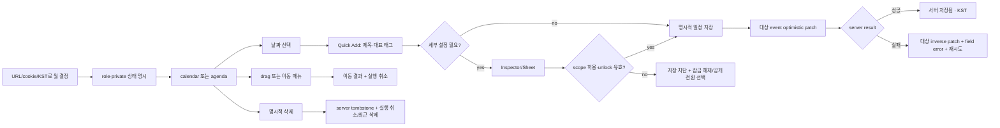
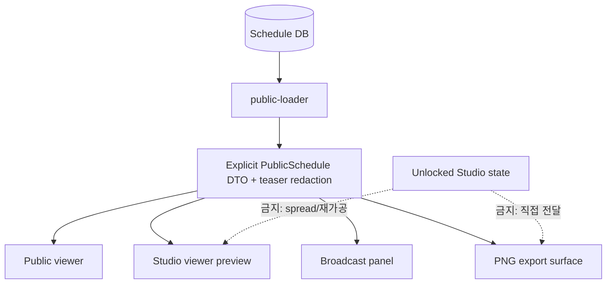

# VIC Schedule Studio 전면 UX/HCI 개선 조사·설계 계획

> 작성일: 2026-07-29 KST  
> 상태: **설계안 — 사용자 승인 전 구현 금지**  
> 기준 커밋: `001326a` (`main`)  
> 검토 자료: `docs/apple-hci-deep-research_260729.md`, 실제 저장소, 현행 ADR·에이전트 문서, 기존 시각 회귀 스냅샷  
> 범위: 공개 포스터, Studio 일정 생성·편집, 비공개 레이어, 미리보기, 꾸미기·PNG export, 반응형·접근성·모션  
> 비범위: 이 문서 작성 단계의 소스 코드·DB·프로덕션 변경

## 조사 방법과 검증 상태

- 실제 코드와 현행 계약을 먼저 확인하고, 딥 리서치는 방향·가설의 근거로 사용했다.
- 근거 우선순위는 `저장소 요구사항/보안 경계 → 현행 Apple HIG → 공식 접근성 표준 → 검증 가능한 HCI 연구 → 첨부 보고서 해석` 순서다.
- 현행 자동 검증:
  - `VISUAL_TEST_FIXTURE=1 npm run build`: 성공.
  - `npm test`: **30 files, 294 tests 통과**.
  - 공개 DTO·경계 테스트는 통과한다. 단, 현재 `roles.test.ts`는 developer 일정 편집을 허용하는 기존 구현을 정답으로 고정하므로 “owner-only 요구사항 충족”을 뜻하지 않는다.
- 현행 시각 자료:
  - `tests/visual/poster.spec.ts-snapshots/viewer-surface-2026-06-desktop-win32.png`를 확인했다.
  - 이 스냅샷은 2026-06 fixture 기반 역사 자료다. 2026-07-29 최신 Studio 실물 검증으로 간주하지 않는다.
- 검증 공백:
  - 연결 브라우저를 사용할 수 없어 인증된 Studio의 실제 클릭·포커스·드래그·터치 동작을 새로 캡처하지 못했다.
  - MacBook, 실제 iPad, iPhone, VoiceOver/NVDA, clipboard 거부 환경은 **NOT VERIFIED**다.

---

## A. 경영진 요약

### A1. 핵심 결론

VIC Schedule Studio는 “처음부터 다시 만들” 제품이 아니다. **익명 public loader/DTO 경계**, KST 날짜 처리, 낙관적 직렬 저장, 데스크톱 inspector, 모바일 bottom sheet, 고정 export surface, 공개 포스터/모바일 agenda 등 중요한 토대가 이미 있다. 다만 authenticated private 경로는 account-global unlock·direct RLS와 legacy scope 때문에 같은 수준으로 안전하다고 볼 수 없다. 최근 Apple HCI 1차 작업으로 material, spring token, sheet drag-close, matched geometry, FLIP, export 완료 보상도 구현됐다.

전면 개선의 중심은 외형이 아니라 다음 네 가지다.

1. **보안과 권한을 UI 상태보다 먼저 바로잡기**
2. **삭제·이동·복제·저장에 일관된 복구 모델 제공**
3. **데스크톱 전용 밀도를 iPad와 터치에 억지로 축소하지 않기**
4. **캘린더를 키보드·스크린리더·단일 포인터로 실제 조작 가능하게 만들기**

### A2. 현재 UX 핵심 문제 10개

1. **잠금 상태에서 비공개 범위가 조용히 공개로 바뀔 수 있다.** 데스크톱 저장과 private in-app paste가 scope를 `"public"`으로 강제하고, 모바일은 반대로 unlock 없이 private를 선택한다. `components/studio/studio-shell.tsx:3199-3205, 3755-3831`.
2. **private unlock 경계가 auth session보다 넓고 legacy path가 남았다.** `unlock_sessions`는 user+calendar라 한 browser unlock이 같은 계정의 다른 session까지 열 수 있다. 알려진 default passcode·hint, rate limit 부재, unversioned pepper hash가 함께 있다. DB/type에는 deprecated `embargo`와 direct authenticated private policy/grant 흔적도 남는다. `lib/private-layer/unlock.ts:7-70`, `db/migrations/0001_initial_schema.sql:3,52-59`, `db/policies/0001_rls.sql:76-136`.
3. **server save가 원자적이지 않아 실패가 일부만 commit될 수 있다.** event row 뒤 tags delete/insert와 private meta가 별도 호출이며, link/reorder도 여러 update다. 중간 실패 시 UI는 rollback돼도 DB body·tag·order는 이미 달라질 수 있고 whole-array client rollback은 이후 편집까지 지울 수 있다. `lib/schedules/event-actions.ts:164-248`, `link-actions.ts`, `studio-shell.tsx:373-637`.
4. **공개 미리보기가 서버 공개 DTO를 재사용하지 않는다.** Studio의 낙관적 event를 객체 spread해 teaser 실제 제목이 공개 시각 전에 preview/insights/export에 노출될 수 있다. broadcast는 server public snapshot만 쓰는 안전한 negative control이다. `studio-shell.tsx:1468-1488, 5123-5146`.
5. **owner-only 일정 본문 요구와 구현 권한이 다르다.** developer가 본문을 편집할 수 있고 manager tag/support action의 target scope·calendar·payload 검증도 충분하지 않다. manager support/tag와 manager/worker decoration은 별도 운영 capability로 보존해야 한다. `CLAUDE.md:41-77`, `lib/permissions/roles.ts:8-43`.
6. **미게시 제목·URL이 평문 localStorage draft에 남는다.** scope가 public이어도 게시 전 내용은 민감할 수 있고, 10분 TTL은 저장 키를 물리적으로 자동 삭제하지 않는다. `studio-shell.tsx:6479-6525`.
7. **삭제·이동·복제가 복구·대체 조작을 충분히 제공하지 않는다.** 삭제는 hard delete와 숨은 fling을 쓰며 touch undo가 없다. drag와 Ctrl/Cmd+C/V를 모르면 이동·복제를 찾기 어렵다. `studio-shell.tsx:2300-2369, 2525-2560, 3339-3950`.
8. **캘린더 의미구조와 키보드 모델이 불완전하다.** 42개 날짜가 각자 tab stop이며 Enter 일부만 지원한다. Space, roving focus, 행/열·요일 관계, 선택일 event command list가 없다. `studio-shell.tsx:5550-5841`.
9. **iPad portrait와 short landscape가 desktop/차단 UI를 받는다.** 768px에서는 desktop grid/form이 압축되고 coarse-pointer landscape는 전체 overlay로 막힌다. `lib/ui/breakpoints.ts:18-35`, `studio-shell.css:6127-6169`, `app/layout.tsx:72-89`.
10. **title contract·modal·motion·export 피드백은 부분 구현이다.** newline title/detail이 암묵적이고, modal focus/inert와 OS Reduce Motion이 불균일하며, clipboard export 실패 시 download fallback이 없다.

### A3. 가장 큰 개선 기회

- 날짜를 고른 뒤 **빠른 생성 → 필요할 때 상세 편집**으로 확장하는 2단계 편집 모델
- delete·move·duplicate·reorder용 operation ledger와 모든 장치에서 누를 수 있는 **실행 취소/다시 실행**
- “드래그는 가속 수단, 메뉴·날짜 선택은 완전한 대안”인 이동·복제 모델
- 공개 DTO 하나를 viewer, preview, broadcast, export가 공유하는 **단일 공개 경계**
- viewport만이 아니라 content width와 input capability를 고려하는 **desktop / touch-tablet / mobile** 적응
- 목적·상태·복구 가능성을 전달하는 절제된 motion과 status copy

### A4. Apple에서 참고할 원칙

- **Agency / Responsibility:** 사용자가 결과를 예측하고 실수를 되돌리며, private 정보가 언제 보이는지 통제한다.
- **Familiarity / Flexibility:** click, touch, keyboard, pointer를 동등하게 지원한다.
- **Simplicity:** 자주 쓰는 제목·태그·저장만 먼저 보이고, 공개 범위·teaser·업도움은 필요할 때 연다.
- **Feedback:** 저장, 이동, 실패, 잠금, export 결과를 작업 위치 가까이서 알려준다.
- **Context preservation:** calendar를 가리지 않으면서 선택 날짜와 편집 대상을 유지한다.
- **Purposeful motion:** 공간 관계와 상태 변화만 설명하고, 반복 작업의 장식 motion은 줄인다.

### A5. 적용하지 말아야 할 Apple식 요소

- export content 위 Liquid Glass, blur, 과한 translucency
- 모든 button의 spring bounce와 X icon 회전
- 작은 popover 안에 복잡한 일정 form 전체를 넣는 방식
- drag-only, hover-only, gesture-only 상호작용
- 네이티브 앱 관습을 웹 keyboard/assistive technology 계약보다 우선하는 방식
- 통계·게임화·파티클을 일정 생성 핵심 흐름에 추가하는 방식
- macOS Calendar 외형이나 toolbar 배열을 그대로 복제하는 방식

### A6. 예상 사용자 경험 변화

| 현재 | 개선 후 |
|---|---|
| 날짜 선택 후 복잡한 form 전체 해석 | 제목과 대표 태그로 즉시 시작, 상세 옵션은 확장 |
| drag·단축키를 알아야 빠름 | 보이는 메뉴와 keyboard shortcut 모두 제공 |
| 삭제 뒤 Ctrl/Cmd+Z를 기억해야 함 | 같은 자리 snackbar의 `실행 취소`, history에서 재복구 |
| private unlock 상태가 역할·장치별로 다르게 보임 | 모든 허용 역할에 persistent warning, 명시적 재잠금 |
| iPad portrait에 압축 desktop | compact month overview + agenda + touch sheet |
| “저장됨”의 저장 위치가 모호 | `편집 중(메모리)`, `서버 저장 중`, `서버 저장됨`, `저장 실패` 분리 |
| preview가 optimistic Studio 객체를 재가공 | public loader/DTO 기반 preview와 export |

---

## B. 첨부 보고서 검토 결과

### B1. 유용한 주요 근거

딥 리서치의 다음 방향은 제품과 직접 맞는다.

- 편집 중 calendar 맥락 유지
- desktop의 작은 quick editor와 지속되는 inspector 조합
- compact view에서 sheet 사용
- drag ghost, drop target, 실패 복귀, undo
- progressive disclosure
- 짧고 목적 있는 feedback/motion
- keyboard·touch target·contrast·Reduce Motion 고려

이들은 개선 방향으로 채택하되, 수치와 상세 동작은 실제 제품 검증을 거친다.

### B2. 신뢰도 높은 부분

| 보고서 ID | 채택 판단 | 프로젝트 적용 |
|---|---|---|
| `APL-003` Feedback | 방향 채택 | 저장·이동·실패를 작업 위치와 status region에서 알림 |
| `APL-004` Modality | 제한 채택 | 복잡한 편집은 sheet/inspector, critical decision만 modal |
| `APL-005` Undo | 채택 | 우선 delete/move/duplicate/reorder operation undo; 저장된 본문 version history는 사용 데이터가 있을 때만 |
| `HCI-001` Fitts | 첨부 ID 대신 검증한 원 논문 `SUP-HCI-FITTS`로 제한 인용 | 고빈도·중요 target을 충분히 크게 하고 가까이 배치 |
| `HCI-002` Hick-Hyman | 첨부 ID 대신 검증한 원 논문 `SUP-HCI-HICK`으로 제한 인용 | 최상위 action 수를 줄이고 나머지는 맥락 메뉴로 |
| `HCI-003` Working memory | 첨부 ID 대신 검증한 원 논문 `SUP-HCI-COWAN`으로 제한 인용 | 편집 대상·날짜·결과 preview를 화면에 남김 |

### B3. 해석에 주의해야 하는 부분

1. 출처 목록 `docs/apple-hci-deep-research_260729.md:221-238`에는 URL, 정확한 문서 제목, 판/버전, 접근일, DOI가 없어 ID를 독립 검증하기 어렵다.
2. 보고서는 WWDC·동료평가 자료 우선이라고 선언하지만 WWDC 근거는 실제로 연결하지 않는다.
3. `HCI-001`은 drag의 필수성이나 44×44를 직접 증명하지 않는다.
4. “항목이 8개 이상이면 상위 3개만 노출”, “작업기억 4±1이므로 셀 정보를 제한”은 법칙에서 직접 나오는 제품 수치가 아니다. 사용성 테스트 가설로만 사용한다.
5. 5~10% 명도, `scale(.96)`, 50/100/150/300ms 등 정밀 수치는 출처가 없다. motion token 후보이지 준수 기준이 아니다.
6. 44×44는 좋은 touch 제품 목표지만 WCAG 2.2 AA의 최소치가 아니다. SC 2.5.8 AA는 24×24 CSS px 또는 간격 예외다.
7. “Tab으로 모든 날짜 셀 접근”은 42개 이상 tab stop을 만든다. interactive grid라면 한 tab stop과 arrow-key roving focus가 더 적절하다.
8. popover 자동 닫기와 auto-save를 결합하면 private scope·publish 상태에서 오저장을 만들 수 있다. nonmodal quick editor와 explicit commit의 경계를 명시해야 한다.
9. 보고서 본문은 `HCI-005`를 direct manipulation/mental model과 Undo 양쪽에 쓰지만 출처 목록은 NN/g Undo/Redo 하나로 정의한다. 내부 ID가 일치하지 않아 scope broadening·fling delete 근거로 사용하지 않는다.
10. `CASE-001~004`의 macOS Sonoma/iPadOS 17 사례는 2023-era 관찰이며 2026 현행 동작 근거가 아니다. 역사적 pattern 예시로만 사용한다.

### B4. 프로젝트와 직접 관련 없거나 후순위인 부분

- 통계 화면 적극 확대: 공개 insights가 이미 있고 schedule authoring 핵심 과업 근거가 없다.
- Keynote/Pages식 surface animation의 광범위 적용
- Apple material 외형 재현
- 최근 제목·템플릿 자동 추천: 유용할 수 있으나 사용 빈도 데이터가 없는 P3 실험
- drag를 기본이자 필수 상호작용으로 만드는 제안

### B5. 추가 검증이 필요한 주장

- 사용자가 하루 일정 수를 실제로 최대 2개로 제한하려는지
- separate title/subtitle가 데이터 모델 변경 비용만큼 가치가 있는지
- explicit save를 없앴을 때 오게시·scope 오류가 감소하는지 증가하는지
- iPad portrait에서 month overview와 agenda 중 어느 쪽이 더 빠른지
- 8초 undo snackbar가 충분한지, persistent history가 필요한지
- button bounce가 만족감을 높이는지 반복 작업 피로를 높이는지

### B6. 연구 공백

- owner/developer/manager/worker/viewer 역할과 server authorization
- public/private DTO, teaser redaction, unlocked state export 방지
- KST date-only, KST wall-clock, UTC 저장 경계
- local draft의 민감정보 저장 정책
- unlock brute-force 방어와 shared-device threat model
- calendar ARIA grid와 screen reader 실제 사용성
- iPad Stage Manager/Split View 같은 중간 content width
- clipboard 미지원·권한 거부 export fallback
- multi-device 동기화 충돌과 optimistic rollback

### B7. 보충 조사 근거 원장

아래는 첨부 보고서와 구분한 **추가 조사**다. 모두 2026-07-29 KST 접근.

| ID | 원자료 | 직접 주장 | 프로젝트 해석 | 신뢰도 |
|---|---|---|---|---|
| `SUP-APL-2026` | [Apple HIG — Design principles](https://developer.apple.com/design/human-interface-guidelines/design-principles) | 2026 원칙: Purpose, Agency, Responsibility, Familiarity, Flexibility, Simplicity, Craft, Delight | 공개 경계·복구·다중 입력·단순한 기본 흐름의 상위 판단 기준 | 높음 |
| `SUP-APL-FEEDBACK` | [Apple HIG — Feedback](https://developer.apple.com/design/human-interface-guidelines/feedback) | clear, integrated, actionable feedback; alert 남용 금지 | inline error, status, actionable snackbar | 높음 |
| `SUP-APL-DND` | [Apple HIG — Drag and drop](https://developer.apple.com/design/human-interface-guidelines/drag-and-drop) | drag alternative, continuous feedback, undo, platform 차이 | drag는 가속 수단; menu/date picker 대안 필수 | 높음 |
| `SUP-APL-UNDO` | [Apple HIG — Undo and redo](https://developer.apple.com/design/human-interface-guidelines/undo-and-redo) | 실수 복구와 undo/redo의 예측 가능한 제공 | 일정 command history와 visible undo action | 높음 |
| `SUP-APL-POP` | [Apple HIG — Popovers](https://developer.apple.com/design/human-interface-guidelines/popovers/) | 적은 관련 기능, wide view, compact view는 sheet; auto-dismiss work 보존 | quick add만 popover, 전체 form은 inspector/sheet | 높음 |
| `SUP-APL-MODAL` | [Apple HIG — Modality](https://developer.apple.com/design/human-interface-guidelines/modality) | 명확한 이익이 있을 때만 modal | scope 전환·복구 불가 행동만 confirmation | 높음 |
| `SUP-APL-MOTION` | [Apple HIG — Motion](https://developer.apple.com/design/human-interface-guidelines/motion) | motion은 목적 있고 짧고 선택 가능해야 함 | 반복 button bounce 축소, 상태 motion 우선 | 높음 |
| `SUP-APL-A11Y` | [Apple HIG — Accessibility](https://developer.apple.com/design/human-interface-guidelines/accessibility) | 다양한 감각·운동·인지 요구와 input 지원 | OS motion preference, 충분한 target, 대체 입력 | 높음 |
| `SUP-WCAG-2.5.7` | [WCAG 2.2 — Dragging Movements](https://www.w3.org/WAI/WCAG22/Understanding/dragging-movements.html) | drag 기능은 non-drag single-pointer 대안 필요, Level AA | `이동…`, `복제…`, up/down action 제공 | 높음 |
| `SUP-WCAG-2.5.8` | [WCAG 2.2 — Target Size](https://www.w3.org/WAI/WCAG22/Understanding/target-size-minimum.html) | 24×24 CSS px 또는 간격 예외, Level AA | 24는 compliance floor, 44는 touch 제품 목표 | 높음 |
| `SUP-WCAG-2.4.3` | [WCAG 2.2 — Focus Order](https://www.w3.org/WAI/WCAG22/Understanding/focus-order.html) | focus order가 의미·조작성을 보존 | nested focus와 42개 tab stop 정리 | 높음 |
| `SUP-WCAG-1.3.1` | [WCAG 2.2 — Info and Relationships](https://www.w3.org/WAI/WCAG22/Understanding/info-and-relationships.html) | 시각적 구조·관계를 programmatically 전달 | calendar와 graph의 semantic list/table/label | 높음 |
| `SUP-WCAG-1.4.1` | [WCAG 2.2 — Use of Color](https://www.w3.org/WAI/WCAG22/Understanding/use-of-color.html) | 색만으로 정보를 전달하지 않음 | event count·scope·tag에 text/shape 병기 | 높음 |
| `SUP-WCAG-1.4.3` | [WCAG 2.2 — Contrast Minimum](https://www.w3.org/WAI/WCAG22/Understanding/contrast-minimum.html) | text contrast 기준 | poster 축소·tag text 대비 | 높음 |
| `SUP-WCAG-1.4.11` | [WCAG 2.2 — Non-text Contrast](https://www.w3.org/WAI/WCAG22/Understanding/non-text-contrast.html) | control/state graphic의 3:1 contrast | focus·selected·input boundary | 높음 |
| `SUP-WCAG-2.4.11` | [WCAG 2.2 — Focus Not Obscured](https://www.w3.org/WAI/WCAG22/Understanding/focus-not-obscured-minimum.html) | focused component가 author content에 완전히 가려지지 않음 | sticky bar·sheet·keyboard에서 focus 보임 | 높음 |
| `SUP-WCAG-3.3.8` | [WCAG 2.2 — Accessible Authentication](https://www.w3.org/WAI/WCAG22/Understanding/accessible-authentication-minimum.html) | cognitive test를 요구하지 않거나 도움 메커니즘 허용 | passcode paste/autofill/password manager 차단 금지 | 높음 |
| `SUP-WCAG-4.1.2` | [WCAG 2.2 — Name, Role, Value](https://www.w3.org/WAI/WCAG22/Understanding/name-role-value.html) | custom control의 name/role/value 노출 | color picker, grid, sticker property | 높음 |
| `SUP-WCAG-4.1.3` | [WCAG 2.2 — Status Messages](https://www.w3.org/WAI/WCAG22/Understanding/status-messages.html) | focus 이동 없이 상태를 programmatically 전달 | save/delete/move 결과 live region | 높음 |
| `SUP-WCAG-2.3.3` | [WCAG 2.2 — Animation from Interactions](https://www.w3.org/WAI/WCAG22/Understanding/animation-from-interactions.html) | 비필수 interaction animation 비활성 수단, Level AAA | OS + 앱 Reduce Motion 통합을 제품 기준으로 채택 | 높음 |
| `SUP-APG-GRID` | [WAI-ARIA APG — Grid](https://www.w3.org/WAI/ARIA/apg/patterns/grid/) | grid focus/arrow-key pattern | interactive Studio calendar의 후보 모델 | 중간: 패턴은 구현 예시이며 사용자 테스트 필요 |
| `SUP-APG-DATE` | [WAI-ARIA APG — Date Picker Dialog](https://www.w3.org/WAI/ARIA/apg/patterns/dialog-modal/examples/datepicker-dialog/) | arrow/Home/End/PageUp/PageDown date-grid keyboard example | Studio 월 calendar key map의 출발점 | 중간: 예시를 실제 SR/browser 조합에서 검증 |
| `SUP-HCI-FITTS` | [Fitts 1954, DOI 10.1037/h0055392](https://doi.org/10.1037/h0055392) | movement time과 target distance/width 관계 | 고빈도 target 크기·거리의 정성 근거; 44px 직접 근거 아님 | 높음 |
| `SUP-HCI-HICK` | [Hick 1952, DOI 10.1080/17470215208416600](https://doi.org/10.1080/17470215208416600) | 선택 수·정보량과 reaction time 관계 | action hierarchy 가설; `3개만` 같은 고정 수치 근거 아님 | 높음 |
| `SUP-HCI-COWAN` | [Cowan 2001, PMID 11515286](https://pubmed.ncbi.nlm.nih.gov/11515286/) | working-memory capacity 재검토 | context를 화면에 유지하는 정성 근거; cell 항목 수 cap 근거 아님 | 높음 |
| `SUP-SUPA-SESSION` | [Supabase Auth — User sessions](https://supabase.com/docs/guides/auth/sessions) | access JWT의 `session_id` claim은 `auth.sessions`의 session을 고유 식별 | private grant를 account가 아니라 stable auth session에 결속하고 logout 시 server 확인 | 높음: 현 stack 공식 문서 |
| `SUP-SUPA-API` | [Supabase — Securing your API](https://supabase.com/docs/guides/api/securing-your-api) | Data API object reachability는 Postgres GRANT와 RLS 두 층으로 통제 | private direct client path를 GRANT+RLS 모두에서 폐쇄 | 높음: 현 stack 공식 문서 |
| `SUP-OWASP-SESSION` | [OWASP Session Management Cheat Sheet](https://cheatsheetseries.owasp.org/cheatsheets/Session_Management_Cheat_Sheet.html) | CSPRNG session ID, secure cookie 속성, server invalidation, sensitive response `no-store`, token 무로그 | opaque grant·revoke·cache/log 계약의 보충 근거 | 높음: 보안 실무 표준; 제품 UX 수치 근거 아님 |

---

## C. 근거-기능 연결표

태그: `조화-시각/기능/맥락`, `몰입-주의/연속/통제`, `재미-반응/발견/완성`.

### C1. 전체 기능 연결 index

| 기능·화면 | 현재 상태 | 개선 원칙 | 근거 | 9요소 태그 |
|---|---|---|---|---|
| Studio 최초 진입·월 복원 | 부분 구현: cookie 복원, URL params 무시 | 주소가 가리키는 월 우선, 이후 사용자 세션 복원 | `SUP-APL-2026`, 저장소 ADR-0005 | 조화-기능, 몰입-연속 |
| 날짜 선택·빠른 생성 | inspector/sheet 구현, quick tier 없음 | 제목+대표 태그 우선, 상세로 점진 확장 | `SUP-APL-MODAL`, `SUP-APL-POP` | 조화-맥락, 몰입-주의, 재미-발견 |
| 제목·부제목 | newline 암묵 계약 | 입력 구조와 결과 preview를 같은 화면에 | `SUP-HCI-COWAN`, `SUP-APL-FEEDBACK` | 조화-맥락, 몰입-통제 |
| 일정 저장 | optimistic+직렬 queue+KST status 구현; server multi-call partial commit·whole-array rollback 위험 | atomic server transaction+idempotency/version, target rollback, memory draft/server pending/server saved 분리 | `SUP-APL-FEEDBACK`, `SUP-WCAG-4.1.3`, ADR-0006, 저장소 write path | 조화-기능, 몰입-통제, 재미-반응 |
| 공개 범위 | desktop silent broadening, mobile unlock 예외 | fail closed, explicit scope change, server 재검증 | `SUP-APL-2026`, `SUP-APL-FEEDBACK`, 저장소 security boundary | 조화-기능, 몰입-통제 |
| 이동·재정렬 | drag feedback 구현 | drag + 이동 메뉴 + keyboard + undo | `SUP-APL-DND`, `SUP-WCAG-2.5.7` | 조화-기능, 몰입-연속/통제, 재미-반응 |
| 삭제 | optimistic, 부분 undo, fling delete | 명시적 delete, actionable undo, 복구 history | `SUP-APL-UNDO`, `SUP-APL-FEEDBACK` | 몰입-통제, 재미-반응 |
| 복제 | keyboard clipboard만 | visible `복제`, 목적 날짜 선택, Option-drag는 보조 | `SUP-APL-DND`, `SUP-HCI-FITTS` | 조화-기능, 재미-발견 |
| calendar keyboard | Enter 일부, semantic grid 미완성 | roving focus, arrow/Home/End, Space/Enter, list 대안 | `SUP-APG-GRID`, `SUP-WCAG-2.4.3` | 조화-기능, 몰입-통제 |
| iPad portrait | desktop flow 압축 | compact month overview + agenda + bottom sheet | `SUP-APL-2026`, `SUP-APL-POP` | 조화-맥락, 몰입-주의 |
| private mode | account-global unlock/session, warning 역할별 불일치, no-store/bfcache·legacy embargo gap | auth-session grant+server-only gateway, direct private GRANT/RLS 폐쇄, persistent warning·명시적 잠금·만료/cache purge | `SUP-SUPA-SESSION`, `SUP-SUPA-API`, `SUP-OWASP-SESSION`, 저장소 private invariant | 조화-맥락/기능, 몰입-통제 |
| preview | optimistic Studio 객체 재가공 | public DTO source only, teaser canary | 저장소 ADR-0001, `SUP-APL-2026` | 조화-기능, 몰입-통제 |
| viewer/poster | desktop poster+tablet/mobile agenda 구현 | content 우선, filter rail 축약, 텍스트 동등물 유지 | `SUP-APL-2026`, `SUP-WCAG-1.3.1`, `SUP-WCAG-1.4.1/1.4.3` | 조화-시각, 몰입-주의 |
| export | fixed 1840 surface와 성공 feedback 구현 | public-only source, clipboard→download fallback | ADR-0004, `SUP-APL-FEEDBACK` | 몰입-통제, 재미-완성 |
| tag 색상 picker | SV/hue/tone/preset/hex/undo 구현 | pointer 조작+semantic value/keyboard 대안, compact sheet | `SUP-WCAG-2.5.7`, `SUP-APL-POP` | 조화-기능, 몰입-통제, 재미-반응 |
| insights graph | public aggregate와 shared chart·agenda 진입점 구현 | tag가 없는 달에도 entry 유지, text summary/table, focus containment | ADR-0008, `SUP-WCAG-2.4.3` | 조화-맥락, 몰입-주의 |
| modal/popover | 일부 focus restore, trap 불균일 | 공통 dialog primitive, one popover, compact sheet | `SUP-APL-POP`, `SUP-APL-MODAL` | 조화-기능, 몰입-연속 |
| motion | spring/material/FLIP 구현, OS reduce 불완전 | 공간 설명용만, frequent bounce 축소, OS preference 존중 | `SUP-APL-MOTION`, `SUP-WCAG-2.3.3` | 조화-시각, 재미-반응 |
| touch target | viewer 대체로 양호, Studio 일부 30~40px | AA floor 24, 고빈도 touch 목표 44 | `SUP-WCAG-2.5.8`, `SUP-HCI-FITTS` | 조화-기능, 몰입-통제 |

### C2. 핵심 적용 판단

이 표가 §5의 정본이다. B7은 출처 원장, C1은 전체 기능 index이며, 아래는 원칙별 적용·비적용 판단을 한 행에서 추적한다.

| 근거 ID | 원칙·원자료 | 핵심 의미 | 현재 관련 화면·파일 | 현재 문제 | 구체 적용안 | 기대 효과 | 적용하지 않을 조건·단순 대안 | 관련 평가 요소 | 신뢰도 |
|---|---|---|---|---|---|---|---|---|---|
| `SUP-SUPA-SESSION`, `SUP-SUPA-API`, `SUP-OWASP-SESSION` | Supabase auth session·Data API GRANT/RLS·OWASP session management | session 식별과 민감 response/cache/revoke 경계를 request 수명에 맞추고 exposed DB object는 GRANT+RLS 양쪽으로 제한 | private unlock/loader/action, `unlock.ts`, private RLS, Studio lifecycle | account-global unlock, direct JWT private path, default/no-rate-limit, bfcache/cache resurrection | auth `session_id`+opaque grant, server-only minimal DTO gateway, direct private access 폐쇄, no-store+relock/tab/page lifecycle purge | cross-session·cache private 노출 감소, revoke 의미 명확 | cookie grant를 RLS에 전달할 검증된 contract가 없으면 direct private Data API를 열지 않음; 단순 대안은 매 private action마다 passcode지만 UX·rate-limit 비용 큼 | 조화-기능/맥락, 몰입-통제 | 매우 높음: 현 stack·security 경계 |
| 저장소 write path, `SUP-APL-FEEDBACK` | 결과 feedback은 실제 server state와 일치해야 함 | “저장 실패/복구” UI는 DB transaction과 target-scoped rollback이 보장될 때만 신뢰 가능 | event save/tag/private meta, link/reorder, Studio optimistic queue | multi-call partial commit과 whole-array rollback | server-only atomic RPC+idempotency/expected version/affected-row check; failed operation의 target inverse만 조건부 적용 | partial DB state·후속 edit 소실 감소, status 신뢰 향상 | transaction/authorization/failure-injection test가 없으면 optimistic success 확대 금지; 단순 대안은 optimistic UI를 끄고 ack 후 갱신 | 조화-기능, 몰입-통제, 재미-반응 | 매우 높음: 실제 저장소 path |
| `SUP-APL-POP`, `SUP-APL-MODAL` | Apple HIG Popovers·Modality | related task만 popover에 두고 compact/복잡한 작업은 sheet; modal은 parent 차단 이유가 있을 때만 사용 | Studio 새 일정 form, `studio-shell.tsx` | 첫 입력부터 전체 form, iPad 768px desktop 압축 | 날짜·제목·대표 태그 Quick Add→inspector/sheet 상세 확장; scope/publication은 explicit save | 첫 일정 생성 시간·선택 부담 감소, calendar 맥락 유지 | quick tier가 private/scope를 auto-commit해야 하면 quick publish 금지; 단순 대안은 기존 form의 기본/세부 section 분리 | 조화-맥락, 몰입-주의/연속, 재미-발견 | 높음 |
| `SUP-APL-2026`, ADR-0001 | Responsibility·저장소 public boundary | 편의보다 공개 결과의 예측 가능성과 정보 경계를 우선 | Studio preview·그 preview의 insights/export, `public-loader.ts`, `studio-shell.tsx` | unlocked optimistic event projection이 teaser redaction을 우회 | server-saved explicit public allowlist snapshot 하나를 viewer/preview/export가 공유 | private/teaser canary 0, preview 의미 명확 | unlocked client projection은 어떤 장치에서도 사용하지 않음; 저장 전에는 `미저장 변경 미반영` 안내 | 조화-기능, 몰입-통제 | 매우 높음: 저장소 invariant |
| `SUP-APL-DND`, `SUP-WCAG-2.5.7` | Apple drag feedback·WCAG non-drag alternative | direct manipulation에는 destination feedback·복구와 single-pointer 대안이 함께 필요 | calendar event 이동·복제, `studio-shell.tsx` | drag와 keyboard clipboard가 사실상 유일, fling delete 존재 | drag ghost/target 유지 + visible `이동…/복제…/삭제` menu + undo | touch·motor·keyboard parity, 목적지 오류 감소 | menu/date picker 없이 drag만 출시 금지; 저사양에서 ghost animation만 제거하고 target line은 유지 | 조화-기능, 몰입-연속/통제, 재미-반응 | 매우 높음 |
| `SUP-APL-UNDO`, `SUP-APL-FEEDBACK` | predictable recovery·actionable feedback | 실수 후 결과와 복구 action을 가까이 제공 | delete, snackbar, history, `event-actions.ts` | hard delete·부분 Ctrl+Z·touch 복구 부재 | tombstone+same-ID restore, 8초 snackbar, retention 동안 `최근 삭제` | accidental delete와 tag/link/heart 관계 소실 감소 | scheduled purge·RLS·모든 consumer filter가 끝나지 않으면 배포 금지; 단순 대안은 fling 제거+삭제 전 확인이나 복구성이 낮음 | 몰입-통제, 재미-반응 | 높음 |
| `SUP-APG-GRID`, `SUP-APG-DATE`, `SUP-WCAG-2.4.3` | composite grid focus·date key map | grid는 한 tab stop과 방향키를 사용하고 날짜와 event command를 분리 | Studio month calendar, public semantic view | 42개 tab stop, Enter 일부, event와 cell 중첩 | roving date grid + Space select + Enter로 선택일 event list 이동; public에는 semantic list | tab 피로 감소, keyboard/SR event action 접근 | 실제 SR/browser 실측에서 grid가 더 나쁘면 agenda/list를 primary로 유지; poster 자체를 억지 grid로 만들지 않음 | 조화-기능, 몰입-통제 | 중간~높음: APG 예시 실측 필요 |
| `SUP-WCAG-2.5.8`, `SUP-HCI-FITTS` | 24px AA floor·target width/distance 관계 | 조작 target은 최소 기준을 지키고 고빈도 touch action은 더 크게 설계 | mobile month nav, add/save/delete/close | Studio 일부 30~40px, swipe-only action | 24px compliance floor, 고빈도 touch target 44px 제품 목표, action 근접 배치 | 오탭·탐색 거리 감소 | 비조작 poster graphic에 44px 강제 금지; 밀도 높은 fine-pointer control은 32px+spacing 가능 | 조화-기능, 몰입-통제 | 표준 높음; 44px 제품 효과는 실측 |
| `SUP-APL-MOTION`, `SUP-WCAG-2.3.3` | purposeful·optional motion | motion은 공간/상태를 설명하고 비필수 interaction animation은 줄일 수 있어야 함 | 전역 button, sheet, month, drag, export | 반복 bounce·X 회전, OS reduce 전역 미반영 | effective reduce=`OS OR 앱`; frequent control transform 제거, direct manipulation은 접촉 중만 유지 | 방해·멀미·반복 피로 감소 | contact tracking까지 없애 기능을 깨지 않음; frame drop/방해가 있으면 color/text 상태만 남김 | 조화-시각, 재미-반응 | 높음 |
| `SUP-WCAG-1.4.1/1.4.3/1.4.11`, `SUP-WCAG-4.1.2` | 색 단독 정보 금지·contrast·name/role/value | 색, control boundary, semantic value를 시각·프로그램 양쪽에 제공 | event/tag, color picker, forced-colors | spatial picker keyboard value 없음, 유형을 색에 과의존 | tag text/icon/outline 병기, semantic hue/value input, 자동 ink와 actionable contrast warning | CVD·저시력·SR·forced-colors 이해 | pattern이 poster 가독성을 해치면 text/icon/outline만 사용; Apple system color 복제 안 함 | 조화-시각/기능, 몰입-통제 | 높음 |
| `SUP-WCAG-1.3.1`, ADR-0008 | visual relation의 text equivalent | graph의 질문·축·단위·결과를 시각 외 방식으로도 전달 | public/member insights, chart components | entry 조건 결합, summary/table·focus containment 불완전 가능 | chart 제목·요약·선택 data table; 실패와 0 분리; public aggregate allowlist 유지 | SR·저시력 사용자의 동등 정보 접근 | 작성 과업에 답하지 않는 새 통계와 private 운영 metric은 추가 금지; 단순 대안은 요약 문장만 | 조화-맥락, 몰입-주의 | 높음 |
| `SUP-APL-FEEDBACK`, ADR-0004 | 완료 결과는 명확하고 복구/대안 가능 | export 결과와 다음 action을 원인별로 제시 | `poster-export-actions.tsx` | clipboard 거부·미지원이 전체 실패, pixel budget 없음 | public snapshot만 캡처; clipboard→download fallback, 원인별 status, 검증한 pixel cap | browser별 export 성공률·결과 예측 향상 | public DTO gate·font ready·pixel budget 미완이면 고해상도 시도 금지; 단순 대안은 download-only | 몰입-통제, 재미-완성 | 높음 |

---

## D. 현재 UX 진단

### D1. 화면·기능별 등급

| 영역 | 등급 | 구현 상태 | 진단·근거 | 결정 |
|---|---|---|---|---|
| 공개 server loader | 유지 | 구현됨 | public loader가 public/non-draft만 조회하고 teaser redaction 수행 | 경계 테스트 확대, 구조 유지 |
| authenticated private loader/RLS | 전면 재설계 | 부분 구현 | account-global `auth.uid()` unlock, direct authenticated private path, deprecated embargo branch가 auth-session cookie grant를 표현하지 못함 | L8 server-only gateway+GRANT/RLS 폐쇄+legacy migration |
| Studio viewer preview | 구조적 개선 | 부분 구현 | optimistic event spread가 shared redaction을 우회 | public DTO builder로 통합 |
| 일정 본문 권한 | 구조적 개선 | 부분 구현 | owner-only 문서와 owner+developer 코드 불일치 | server/RLS/UI 동시 정렬 |
| private unlock session | 전면 재설계 | 부분 구현 | hash·expiry·version invalidation은 토대. account-global session, default hint, rate limit·no-store/bfcache purge 부재 | auth-session grant·rotation·cache/revoke state machine |
| standalone `/studio/private-layer` | 구조적 개선 | 부분 구현 | manager 허용처럼 안내·panel 렌더하지만 unlock API는 manager 403 | capability matrix와 copy/render 일치 |
| 일정 local draft | 전면 재설계 | 부분 구현 | 선택한 scope가 public이어도 게시 전 제목·URL은 민감할 수 있는데 평문 localStorage에 남고 물리적 자동 만료가 없음 | 모든 일정 draft 로컬 영속 중단; memory-only |
| 최초 진입·월 URL | 경미한 개선 | 부분 구현 | cookie는 복원하지만 `[year]/[month]` params 미사용 | valid URL params 우선 |
| desktop 정보 구조 | 경미한 개선 | 구현됨 | calendar+inspector는 적합. top bar action이 많음 | primary/secondary command 재그룹 |
| iPad portrait Studio | 전면 재설계 | 미구현에 가까움 | 768px에서 desktop grid/form 압축 | touch-native adaptive layout |
| mobile Studio agenda | 구조적 개선 | 부분 구현 | agenda/sheet는 좋음. 월 이동 swipe-only, add target 작음 | visible nav·44px target |
| 월간 calendar 의미구조 | 구조적 개선 | 부분 구현 | role/keyboard/focus 모델 불완전 | roving date grid + 선택일 semantic event list |
| calendar 100/125/150% 확대 | 유지 | 구현됨 | visible −/+ controls, Ctrl+wheel stepper, clipped-text peek와 unit test 존재 | P0 calendar 분리 중 보존; touch는 controls 사용 |
| 일정 quick add | 구조적 개선 | 미구현 | 전체 form부터 시작 | quick tier + detail escalation |
| 제목·부제목 | 구조적 개선 | 부분 구현 | newline 암묵 계약, 길이/preview 없음 | 데이터 모델 결정 후 명시화 |
| 공개 범위 control | 전면 재설계 | 부분 구현 | 잠금·장치에 따라 저장 의미가 달라짐 | fail-closed state machine |
| drag 이동·정렬 | 경미한 개선 | 구현됨 | ghost/target/long press/queue 좋음 | non-drag 대안·announcement 추가 |
| fling-to-delete | 삭제 검토 | 구현됨 | 예상하기 어려운 destructive gesture | 제거 권장 |
| 복제 | 구조적 개선 | 부분 구현 | Ctrl/Cmd+C/V만 | 보이는 action과 date destination |
| 다중 선택 | 삭제 검토 | 부분 구현 | 시각 선택만 있고 일괄 행동 없음 | 행동 연결 또는 기능 제거 |
| 일정 Undo/Redo | 구조적 개선 | 부분 구현 | 세 command만, redo 없음, touch action 없음 | 구조 작업 ledger로 통합; 본문 full history는 P3 |
| 저장 queue·KST status | 유지 | 구현됨 | serialized optimistic write, KST timestamp, unload guard | client serialization primitive만 보존 |
| server multi-table write | 전면 재설계 | 부분 구현 | event→tag delete/insert→private meta와 link/reorder가 별도 call이라 partial commit 가능 | P0 transactional RPC+idempotency/version/affected-row assertion |
| optimistic rollback | 전면 재설계 | 부분 구현 | 전체 array snapshot 복원은 후속 변경 소실 가능 | P0 operation target inverse+conditional apply/refetch |
| modal/focus | 구조적 개선 | 부분 구현 | broadcast panel은 좋은 기준, 나머지 trap/inert 불균일 | 공통 Dialog primitive |
| motion/material | 경미한 개선 | 구현됨 | 최근 HCI 작업 완료. 전역 bounce·OS reduce 공백 | 반복 motion 절제·OS 통합 |
| 공개 poster desktop | 경미한 개선 | 구현됨 | 고정 1840 export 계약 안정. 빈 memo/filter rail 밀도 재검토 | geometry 유지한 hierarchy 개선 |
| viewer tablet/mobile agenda | 유지 | 구현됨 | 641~1040 agenda와 44~48px controls, `이 달 기록` 진입점 존재 | tag가 0개인 달에도 insight action이 rail과 함께 사라지지 않게 결합 해제 |
| tag 색상 선택 | 경미한 개선 | 구현됨 | custom SV·hue·tone·preset·hex·undo·contrast 경고가 있음. SV/hue surface는 pointer 중심 | hex/preset 대안 보존, keyboard value/compact sheet 보강 |
| 공개·관리자 insights | 경미한 개선 | 구현됨 | public aggregate 경계와 shared chart는 좋음. agenda 진입점도 구현됨. tag 없는 달의 조건 결합·dialog focus·chart text alternative 공백 | authoring core와 분리한 채 접근성 보강 |
| poster text selection 전면 차단 | 구조적 개선 | 구현됨 | agenda 제목·링크 복사와 assistive tool 방해 | 장식 surface만 제한 |
| export | 구조적 개선 | 부분 구현 | font wait/progress/fixed surface 좋음, clipboard-only | download fallback·pixel budget |
| sticker keyboard 조작 | 구조적 개선 | 부분 구현 | pointer 중심, 기존 sticker focus 불가 | select/nudge/rotate/resize 대안 |
| seasonal effects | 유지 | 구현됨 | opt-in·export surface 분리 계약 | 기본 off 유지 |
| 휴대폰 가로 차단 overlay | 삭제 검토 | 구현됨 | 전체 사용 차단, `aria-hidden`, 뒤 UI focus 가능 | responsive layout 우선; overlay 제거 |
| design tokens | 구조적 개선 | 부분 구현 | 전역 token 존재하나 CSS에 hard-coded color/radius 다수 | 화면 단위 semantic alias 이관 |
| `StudioShell` 구조 | 구조적 개선 | 구현됨 | 6,578줄 monolith에 권한·state·drag·modal·preview 결합 | behavior 보존하며 단계 분리 |
| `/studio/tags` route | 삭제 검토 | placeholder | 실제 tag 관리가 Studio modal에 있고 route는 안내문만 | canonical `/studio?panel=tags`로 server redirect |

### D2. 전체 page·route inventory

`(auth)`, `(studio)`, `(home)`는 URL segment가 아닌 Next.js route group이다.

| URL / 파일 | 실제 구성·데이터 흐름 | 구현 상태 | 이번 계획의 판단 |
|---|---|---|---|
| `/` — `app/page.tsx` | 익명·viewer는 `getPublicSchedule`→`PublicPoster`; 인증 staff는 `/studio` redirect; Supabase 미설정이면 auth-first 안내 | 구현됨 | public DTO 경계·viewer 성능 유지. poster/agenda 접근성만 개선 |
| `/login` — `app/(auth)/login/page.tsx` | Google OAuth form, in-app browser 안내, error code→friendly copy | 구현됨 | owner-only/private 회귀 fixture에 포함; 시각 재설계 비범위 |
| `/auth/callback` — `app/(auth)/auth/callback/route.ts` | OAuth callback·안전한 next redirect | 구현됨 | auth redirect/open-redirect characterization 유지 |
| `/studio` — `app/(studio)/studio/(home)/page.tsx` | actor+unlock 병렬 조회→`getStudioSchedule`→`StudioShell`; cookie의 월/view 복원 | 구현됨 | 핵심 개선 surface |
| `/studio/calendar/[year]/[month]` | `/studio`와 같은 shell을 렌더하지만 params를 읽지 않고 cookie를 사용 | 부분 구현 | valid params→cookie→KST 현재 월 계약으로 수정 |
| `/studio/decorate/[year]/[month]` | public schedule→`PublicPoster(decorate)`; sticker/theme action은 capability별 주입 | 구현됨 | public source·geometry 유지, keyboard property 조작 보강 |
| `/studio/private-layer` | actor→`PrivateLayerPanel`; 현재 page copy/render와 unlock API role이 불일치하고 standalone 성공 후 unlock 상태 갱신 callback이 없음 | 부분 구현 | Phase 0 capability+L8 session 범위와 일치; 성공/재잠금 상태 갱신 |
| `/studio/tags` | 실제 editor 없이 “연결 예정” 문구 | placeholder | `/studio?panel=tags`로 server redirect; tag editor 한 구현만 유지 |
| `/studio/trusted-members` | admin loader+legacy 단일-role form→`/api/trusted-members`; 삭제·dual-role 없음. 더 완전한 `TrustedMembersPanel`은 Studio 안에 따로 존재 | 부분 구현 | 한 구현으로 통합해 canonical `/studio?panel=members`로 redirect; Phase 0 capability에 맞춰 server/UI/RLS·copy 갱신 |
| `/visual-fixture/poster`, `/visual-fixture/studio` | deterministic visual-test surface | test-only 구현 | production IA 비범위; responsive/security visual fixture로 확대 |
| `app/loading.tsx`, Studio home/month/decorate/private/trusted `loading.tsx` | route별 skeleton 또는 loading surface | 부분 구현 | private text가 skeleton/stream에 섞이지 않는지, layout shift·focus 검증 |
| `app/error.tsx`, `global-error.tsx`, `not-found.tsx` | route/global error와 404 fallback. 현재 error boundary가 `error.message`를 그대로 렌더 | 부분 구현 | public/internal 오류 모두 generic copy+correlation ID만 표시하고 raw server/DB message는 server log로 제한 |

`app/(studio)/layout.tsx`가 viewer를 `/`로 돌리는 group guard이며 Studio·Poster·Broadcast CSS를 선로드한다. page 안 UI 숨김은 이 server guard와 각 action의 authorization을 대체하지 않는다.
`app/layout.tsx`의 `RootLayout`은 routed page 외에 `PresenceBeacon`, service-worker/offline indicator, analytics/speed insight를 공통 mount한다. 이들은 authoring state를 소유하지 않으며 private field를 telemetry에 전달하지 않는 negative test만 이번 범위에 포함한다.

API route inventory:

| 범주 | 실제 route | 상태·경계 | 계획 |
|---|---|---|---|
| 인증 | `/api/auth/login`, `/api/auth/logout` | OAuth 시작/종료 | return path·logout 후 private client purge 검증 |
| 일정 write | `/api/studio-write` | event write command gateway | owner-only body, scope fail-closed, tombstone/restore를 server 재검증 |
| private | `/api/unlock-private-layer`, `/api/private-layer` | unlock은 부분 구현; `/api/private-layer` GET은 현재 항상 401인 stub | rate limit, auth-session grant, server-only private DTO로 명시적으로 구현하거나 stub route 제거; direct JWT negative test |
| 꾸미기 | `/api/sticker-write` | sticker write gateway | manager/worker 운영 예외와 asset 관리 capability 분리 |
| trusted member | `/api/trusted-members` | member 등록/갱신 | owner/developer L6 결정·cross-calendar 차단 |
| 공개 | `/api/public/[calendarSlug]/events`, `/broadcast`, `/proposals` | events/broadcast 구현; proposals GET/POST는 sample·memory synthetic이며 production 저장 아님 | explicit public allowlist·teaser/tombstone canary; prototype proposals는 production 기능처럼 노출하지 않음 |
| 운영 보조 | `/api/presence`, `/api/soop-live`, `/api/cron/broadcast-poll` | presence/live/cron | authoring IA 비범위. public/private field 추가 없이 기존 계약 회귀 검증 |

### D3. 주요 컴포넌트 관계

```mermaid
flowchart TD
  RL[RootLayout] --> ROOT
  RL --> SYS[Presence / Offline / Analytics]
  ROOT[app/page.tsx] --> PL[getPublicSchedule]
  PL --> PP[PublicPoster]
  PP --> PI[PublicInsights]
  PP --> PE[PosterExportActions]
  PP --> SL[StickerLayer]

  SG[app/(studio)/layout.tsx role guard] --> SP[/studio 또는 month page]
  SP --> ACT[resolveCurrentActor]
  SP --> UL[getUnlockState]
  SP --> STL[getStudioSchedule]
  ACT --> SS[StudioShell]
  UL --> SS
  STL --> SS
  SS --> CAL[Desktop calendar / mobile agenda]
  SS --> ED[Desktop inspector / mobile sheet]
  SS --> TAG[TagLegendEditor + ColorPicker]
  SS --> PRE[Viewer preview]
  SS --> BI[BroadcastPanel / MemberInsights]
  PRE -. 금지: Studio event projection .-> PP
  PRE --> PUB[server public DTO snapshot]
  PUB --> PP

  SG --> DEC[decorate page]
  DEC --> PP
  DEC --> DP[DecoratePalette]
  DP --> SL
  SG --> PRIV[PrivateLayerPanel]
  SG --> TM[Trusted-members page]
```

현재 `StudioShell`이 calendar rendering, desktop/mobile editor, optimistic write queue, drag/in-app event copy buffer/history, permission-derived UI, preview, dialog state를 한 client component에 함께 가진다. P2 분리는 먼저 behavior characterization을 고정한 뒤 `calendar/*`, `editor/*`, `overlays/*`, `history/*`, `editor-state/*`로 이동한다. public DTO·권한·KST logic을 React component 안으로 옮기지 않는다.

### D4. 상태 관리 topology와 빈·로딩·오류 상태

| state 층 | 현재 source·수명 | 구현 상태 | 문제·개선 계약 |
|---|---|---|---|
| actor/capability | RSC의 `resolveCurrentActor`, 일부 client prop | 부분 구현 | role→capability 해석이 문서/RLS와 충돌. Phase 0 matrix 하나를 server action, route, UI, test가 공유 |
| public server state | cached `getPublicSchedule`→`PublicSchedule` | 구현됨 | viewer/broadcast 경계는 유지; Studio preview도 같은 explicit DTO snapshot 사용 |
| Studio server state | `getStudioSchedule(actor, unlock)`의 `StudioSchedule` | 구현됨 | unlock 범위 DTO만 반환. L8에서는 private가 server-only gateway 밖으로 나오지 않음 |
| private auth state | DB settings/unlock session→RSC boolean | 부분 구현 | account-global·client 초기 boolean만으로 부족. state machine+expiry/revoke signal+auth-session grant |
| editor/draft | `StudioShell` React form state + 평문 localStorage 10분 draft | 부분 구현 | 모든 schedule draft memory-only, dirty fingerprint/navigation warning; legacy key 물리 삭제 |
| optimistic server write | client events state+직렬 promise queue+API/action result | 구현됨 | save KST status 유지; whole-array rollback→target inverse/version-aware rollback |
| selection/interaction | selected date/event, range highlight, drag/hover, in-app event copy buffer, filters, zoom | 부분 구현 | focus/selection/edit 분리; 행동 없는 range highlight 제거; in-app buffer/history에서 private purge. OS clipboard는 앱이 지울 수 없으므로 private event를 자동 기록하지 않음 |
| view persistence | `VIEW_COOKIE`의 public/studio/decorate 월·preview, UA-derived initial narrow | 구현됨 | 월 URL 우선; cookie는 non-sensitive preference만. topology는 CSS container가 정본 |
| PublicPoster local state | view/filter/heart/revealed teaser/sticker history; heart delta는 sessionStorage, avatar·sticker clipboard는 localStorage | 구현됨 | schedule/private body 저장소와 분리 유지; storage payload에 private canary가 들어가지 않는 test |
| overlay | modal별 boolean/ref/focus code | 부분 구현 | 공통 Dialog/Popover/Sheet stack, focus containment/restore/back 계약 |
| history | move/delete 등 분산 undo state, redo 없음 | 부분 구현 | P0 delete ledger, P1 structural operation ledger; private relock 시 content purge. saved-body full history는 P3 evidence gate |
| loading | Next route loading files, 일부 async status | 부분 구현 | 기존 content를 유지할지 skeleton을 쓸지 action별 고정; save/export/unlock `aria-busy` |
| empty | 빈 달·tag 0·insights 0·trusted member 0 | 부분 구현 | “0”과 fetch error 분리; month nav/add/insights 같은 다음 action은 남김 |
| error | global/route error + component toast/inline copy | 부분 구현 | field error는 field와 연결, recoverable action은 retry/undo, security error는 generic; state를 지우지 않음 |

### D5. 일정 데이터 모델 inventory

| model/table·type | 현재 핵심 field·관계 | 공개 경계 | 상태·결정 |
|---|---|---|---|
| `calendars` / `CalendarIdentity` | id/slug/name, owner·co-owner, public memo/layout, poster theme | public identity·safe theme/memo만 | 구현됨; owner/co-owner capability fixture 필요 |
| `events` / `StudioScheduleEvent` | date/end, time/all-day, title/description, status, scope, category, support/link, tentative, teaser/reveal, sort, `secret_cipher` | public은 `visibility_scope=public`, non-draft, teaser redaction 후 `PublicScheduleEvent` | 구현됨. deprecated `embargo` enum/type/UI path가 남아 0025 적용·row/cipher audit 필요. `deleted_at`은 P0 신규; title/subtitle 의미는 L2 |
| `event_tags`↔`broadcast_tags` | M:N tag, order/primary; tag name/kind/parent/color/active | public event에 허용 tag ID와 safe tag definition | 구현됨. 전체 6/대표 2 상한은 L7; private event relation도 L8 gateway 밖 direct read 금지 |
| `color_palette` | calendar color key, background/text/border/order | safe palette만 | 구현됨; semantic keyboard picker와 contrast 검증 |
| `event_private_meta` + `events.secret_cipher` | private title/memo/editor note의 legacy relation과 AES-GCM blob | 절대 public DTO에 없음 | 부분 migration 상태. private title migration은 decrypt→transform→reencrypt만 |
| `private_layer_settings`, `unlock_sessions` | passcode hash/version/duration, user/calendar/expiry | public 노출 없음 | hash/expiry 구현; auth-session grant hash·`session_id` scope는 L8/P0 신규 |
| `stickers`, sticker assets, poster theme | month geometry/type/content/asset/order | public poster에 렌더 가능한 decoration | 구현됨; write는 schedule body와 별도 capability |
| event/calendar hearts, proposals, requests, support/variant data | public interaction·운영 관계 | endpoint별 explicit allowlist | 구현됨/일부 운영 전용; tombstone consumer inventory에 포함 |
| `trusted_members`, calendar co-owner relation | email, manager/worker dual role, active, calendar binding | public 노출 없음 | 구현됨; L6 capability와 cross-calendar server/RLS test 필요 |
| variant/proposal/request types | `variantGroups`, `proposals`, `requests`가 domain/sample에는 있으나 production loader는 빈 배열, 대응 DB 없음 | production 계약 아님 | prototype/미구현으로 명시; UX roadmap에 production 기능으로 가정하지 않음 |

`PublicScheduleEvent`는 `visibilityScope:"public"`과 non-draft status만 표현한다. `StudioScheduleEvent`는 draft와 `public/work/owner_private` 및 private metadata를 추가한다. 이 type 차이는 유지하되 “타입으로 cast했으니 안전”으로 보지 않고 query allowlist→server mapper→DTO canary를 모두 통과해야 한다.

KST 정본:

- `date_key`/`end_date_key`는 `YYYY-MM-DD` **KST calendar date**다. JS `Date`의 UTC 변환으로 날짜를 앞뒤로 이동시키지 않고 date-only parser/formatter를 쓴다.
- `start_time`/`end_time`은 해당 KST date에 붙는 wall-clock time이다. 정렬·표시는 `Asia/Seoul` 문맥에서 처리한다.
- unlock expiry, teaser reveal, audit/update timestamp 같은 `timestamptz`는 UTC instant로 저장·server 비교하고 사용자에게만 KST로 표시한다.
- current day/month은 browser locale timezone이 아니라 `Asia/Seoul`; week start는 일요일이다.
- UTC−/UTC+/KST midnight, month/year end, DST가 있는 비-KST browser timezone에서 date-only round trip·month move·today·reveal/expiry를 test한다.

### D6. 중복·임시·삭제 후보

- `StudioShell` 안 desktop/mobile editor JSX와 permission branch가 부분 중복된다. 먼저 공통 command/state를 추출하고 view만 장치별로 둔다.
- Studio viewer preview의 별도 object-spread mapping은 public loader와 중복이며 보안상 삭제한다.
- `/studio/tags` placeholder는 임시 UI다. canonical panel redirect로 제거한다.
- `/studio/trusted-members`의 legacy 단일-role form과 Studio의 `TrustedMembersPanel`이 기능 중복·불일치다. canonical `/studio?panel=members`로 통합한다.
- `[year]/[month]` page가 `/studio` loader를 복제하면서 params를 버린다. 공통 loader/helper와 route 우선순위로 정리한다.
- 행동 없는 range/multi-select highlight, fling delete, landscape blocking overlay는 기능 보완보다 제거가 우선이다.
- legacy localStorage schedule draft reader/writer와 default passcode hint/constant는 migration·rotation 뒤 삭제한다.
- `support_campaigns`는 DB/loader에는 있으나 확인된 UI consumer가 없다. 공개 loader payload 비용과 실제 사용자 질문을 측정해 P2에서 연결하거나 제거하며, 새 surface를 추측해 만들지 않는다.
- variant/proposal/request는 type/sample·synthetic API뿐이다. production DB 기능으로 오인될 copy/route를 제거하거나 명확히 test fixture로 격리한다.

---

## E. 사용자 흐름 비교

### E1. 흐름별 현재 상태와 개선 상태

| 흐름 | 현재 | 개선 | 성공 기준 |
|---|---|---|---|
| 최초 진입 | staff `/`→`/studio`; Studio 월 route가 URL params보다 cookie 사용 | URL의 valid year/month 우선, 없으면 cookie, 없으면 KST 현재 월. role별 read-only/edit 상태를 header에 명시 | bookmark cold-entry가 같은 월·같은 권한 상태로 열림 |
| 일정 생성 | 날짜 선택→desktop inspector/mobile sheet→전체 form→저장 | 날짜 선택→quick add(제목, 대표 태그, `일정 저장`)→`세부 설정`으로 inspector/sheet 확장 | 신규 사용자 median 생성 시간 감소, scope 오선택 0 |
| 일정 수정 | event 선택→같은 form; local draft 복원 | event 선택 시 source↔editor 연결 유지, 변경 field 표시, dirty-memory/server 상태 분리 | 수정 대상·날짜·공개 범위를 항상 식별 |
| 일정 이동 | drag/drop 또는 일부 keyboard | drag + `이동…` menu/date picker + arrow shortcut; 결과 announcement + undo | mouse/touch/keyboard 모두 같은 결과 |
| 일정 삭제 | trash 또는 fling; 즉시 hard delete; Ctrl/Cmd+Z 부분 지원 | 명시적 delete만. server tombstone으로 동일 ID·관계를 보존하고 8초 snackbar+`최근 삭제`에서 복구 | touch에서도 undo 성공, accidental delete 감소 |
| 일정 복제 | Ctrl/Cmd+C→날짜→Ctrl/Cmd+V | event menu `복제…`→기본 같은 날짜 아래/다른 날짜 선택; keyboard shortcut 병행 | shortcut 지식 없이 복제 가능 |
| 미리보기 | optimistic Studio event를 spread해 public 형태로 가공 | **server public snapshot만** preview. Studio unsaved change는 `저장 후 미리보기에 반영`으로 명시 | teaser/private canary 0건 |
| 저장 | explicit 저장, optimistic UI, queue, 10분 local draft | explicit commit 유지 권장. 모든 미저장 일정은 memory-only; `편집 중/서버 저장 중/서버 저장됨·KST/실패` 분리; navigation dirty warning과 retry | 저장 상태 이해도, reload 후 결과 일치 |
| 내보내기 | 1840 surface 캡처→clipboard, 성공 thumbnail | public-only render→clipboard 시도→미지원/거부 시 PNG download→성공 결과와 파일명 표시 | supported browser 전부 결과 파일 획득 |

### E2. 현재 authoring 흐름



### E3. 개선 authoring 흐름



### E4. 공개·미리보기·export 경계



---

## F. 화면별 레이아웃 개선안

### F0. 공통 원칙

- 장치 이름은 설명용이다. 구현은 user-agent 분기보다 **content container width + input capability + orientation**을 우선한다.
- 공개 poster의 `1840px` design surface는 export/sticker geometry 계약이므로 내부 reflow하지 않는다.
- Studio는 poster와 다른 responsive 계약을 사용한다.
- layout 전환 후보는 **Studio content container 폭**으로만 정한다.
  - compact: `≤640px`
  - medium: `641–999px`
  - two-pane: `1000–1319px`
  - wide three-pane: `≥1320px`
- `pointer: coarse/fine`, touch, pen, hardware keyboard는 target size·gesture·hover만 바꾸고 정보 구조를 갈라놓지 않는다. 같은 1024px이면 MacBook과 iPad 가로의 기본 topology는 같아야 한다.
- 첫 SSR은 CSS/container query가 결정한다. JS capability 감지는 drag·haptic 같은 progressive enhancement에만 사용해 hydration 전후 action이 사라지지 않게 한다.
- 현재 제품의 주 시작은 **일요일**이다. Studio·viewer·export·keyboard Home/End·fixture 모두 `일→토`를 유지한다.
- 실제 값은 320×568, 390×844, 844×390, 640/641, 768×1024, 999/1000, 1024×768, 1319/1320, 1366×768, 1440×900, 1920×1080 fixture에서 검증 후 고정한다.

### F1. 데스크톱 — 1320px 이상 wide, pointer/keyboard 중심

```text
┌──────────────────────────────────────────────────────────────────────────────┐
│ VIC Studio │ 2026년 7월  ‹ 오늘 › │ 저장됨 14:32 KST │ 미리보기 │ Export   │
├──────────────┬───────────────────────────────────────────┬───────────────────┤
│ 필터          │ 월간 캘린더                               │ 편집 Inspector     │
│ 콘텐츠 태그   │ 일 월 화 수 목 금 토                      │ 7월 29일 · 공개    │
│ 상태·공개범위 │ ┌────┬────┬────┬────┬────┬────┬────┐     │ 제목              │
│ 상태          │ │    │    │    │    │    │    │    │     │ [              ]  │
│ 공개 범위     │ │ 일정 block / drop indicator          │     │ 대표 태그         │
│ [필터 접기]   │ └────┴────┴────┴────┴────┴────┴────┘     │ [세부 설정 ▾]      │
│               │ 선택: 7/29 · 1개                         │ [일정 저장]        │
├──────────────┴───────────────────────────────────────────┴───────────────────┤
│ 상태/실행 취소 snackbar: “풀트뱅”을 7월 30일로 이동함  [실행 취소]          │
└──────────────────────────────────────────────────────────────────────────────┘
```

- filter는 실제로 사용할 때만 220–240px rail.
- inspector는 320–360px, calendar는 최소 720px 확보.
- top bar는 월 이동·save·preview/export만 1차. tag/member/insights/private/decorate는 `관리` menu로 묶는다.
- `내보내기`는 unlocked Studio 객체를 직접 캡처하지 않고 public DTO preview를 연 뒤 export한다. 꾸미기 진입은 별도 action이다.
- quick add는 선택 cell 가까운 작은 popover로 시작할 수 있으나, 상세 form은 inspector에서 유지한다.

### F2. MacBook·중간 폭 — 1000~1319px, pointer/keyboard 중심

```text
┌──────────────────────────────────────────────────────────────────────┐
│ Studio │ ‹ 2026.07 › │ 저장 상태 │ + 일정 │ Preview │ 더보기 …      │
├───────────────────────────────────────────┬──────────────────────────┤
│ Calendar, visible width ≥640              │ Inspector 320–340        │
│ [필터 3] [공개] [콘텐츠 태그 ▾]           │ 선택 날짜·scope 고정      │
│ 7-column grid                             │ quick → detail fold       │
│                                           │                          │
├───────────────────────────────────────────┴──────────────────────────┤
│ undo snackbar                                                       │
└──────────────────────────────────────────────────────────────────────┘
```

- persistent filter rail 제거, top filter chips/popover로 전환.
- 1000px 미만에서는 inspector를 함께 줄이지 않고 F4의 overview+agenda+modal bottom sheet로 전환한다.
- `CSS zoom`에 기대지 않고 calendar cell density·typography를 조절한다.
- vertical height가 짧으면 inspector 내부만 scroll; Save/Cancel은 sticky.

### F3. iPad 가로 — 같은 two-pane topology, coarse pointer/touch 보강

```text
┌──────────────────────────────────────────────────────────────────────┐
│ ‹ │ 2026년 7월 │ 오늘 │ ›                     [필터] [+ 일정] [···] │
├──────────────────────────────────────────────┬───────────────────────┤
│ compact month grid                           │ nonmodal side inspector│
│ touch target 44px                            │ 제목·대표 태그          │
│ tap=선택, long-press drag=가속 수단           │ 세부 설정               │
│ event menu=이동/복제/삭제                     │ [취소] [일정 저장]      │
└──────────────────────────────────────────────┴───────────────────────┘
```

- 1024px landscape에서도 F2와 같은 calendar+inspector를 쓴다. 차이는 44px target, hover 비의존, touch drag threshold다.
- side inspector는 **nonmodal**이라 calendar를 inert 처리하거나 focus trap하지 않는다.
- Split View로 container가 1000px 미만이 되면 F4의 bottom/full-height **modal sheet**로 전환한다.
- Apple Pencil hover/drag는 보조. 모든 action은 tap menu로 가능해야 한다.
- hardware keyboard가 연결되면 desktop shortcut와 roving grid를 그대로 지원한다.

### F4. iPad 세로 — touch 중심

```text
┌──────────────────────────────────────────┐
│ ‹ │ 2026년 7월 │ 오늘 │ ›        [필터] │
├──────────────────────────────────────────┤
│ compact month overview                   │
│ 날짜별 점/최대 2개 대표 색, “+n”         │
├──────────────────────────────────────────┤
│ 7월 29일 수요일                  [+ 일정]│
│ ┌ 공개 │ 풀트뱅                     ··· ┐│
│ └ 태그 · 세부 내용                      ┘│
│ ┌ 작업 │ 썸네일 작업                ··· ┐│
│ └────────────────────────────────────────┘│
└──────────────────────────────────────────┘
      ↑ tap → bottom sheet (50%/90% detent)
```

- month overview는 날짜 위치 파악용, agenda는 읽기·편집용.
- “하루 최대 2개”가 hard rule이 아니라면 overview에는 visible event count·shape/outline cue를 기본으로 두고 대표 2색은 보조로만 쓴다. agenda는 모든 event를 표시한다.
- sheet를 닫아도 선택 날짜와 scroll 위치를 보존한다.

### F5. 좁은 모바일 — 320~640px

```text
┌──────────────────────────────┐
│ ‹ │ 2026.07 │ 오늘 │ ›      │
│ [콘텐츠] [공개] [필터 2]     │
├──────────────────────────────┤
│ 7/29 수             [+ 일정] │
│ 공개  풀트뱅              ···│
│       세부 내용               │
│                              │
│ 7/30 목                       │
│ 아직 일정 없음                │
└──────────────────────────────┘
┌──────── bottom sheet ────────┐
│ 7월 29일 · 공개               │
│ 제목                          │
│ 대표 태그                     │
│ 세부 설정 ▾                   │
│ [삭제]       [일정 저장]      │
└──────────────────────────────┘
```

- swipe 월 이동은 유지하되 이전/오늘/다음 button을 항상 노출한다.
- `+ 일정`과 sheet close/save/delete는 최소 44px touch 목표.
- 가로모드 전체 차단 overlay를 제거하고 동일 agenda를 유지한다.
- delete 후 sheet를 닫더라도 화면 아래 snackbar와 undo button은 남는다.

### F6. 모든 Studio 폭에 적용되는 role·private 상태 delta

F1~F5의 첫 content row에는 아래 상태 중 하나가 반드시 존재한다. private data를 단순 CSS hide하지 않는다.

```text
LOCKED
┌────────────────────────────────────────────────────────────────┐
│ 🔒 비공개 일정 잠김                         [잠금 해제]        │
└────────────────────────────────────────────────────────────────┘
private rows/forms/in-app event copy buffer/history/query cache: client에 없음

UNLOCKED / EXPIRING
┌────────────────────────────────────────────────────────────────┐
│ ⚠ 비공개 일정 표시 중입니다. 방송 화면 공유에 주의하세요.     │
│   14:58 KST까지 · 저장하지 않은 변경 1개       [지금 잠그기]  │
└────────────────────────────────────────────────────────────────┘

EXPIRED / RELOCKED
┌────────────────────────────────────────────────────────────────┐
│ 🔒 세션이 만료되어 비공개 내용을 지웠어요. [다시 잠금 해제]  │
└────────────────────────────────────────────────────────────────┘
```

| role | Studio 표현 | 편집 |
|---|---|---|
| owner | public/work/owner_private, unlock 후 private | schedule body·허용 설정 편집 |
| developer | diagnostics+read-only role preview | 실제 schedule body/owner_private 편집 금지 |
| manager | public schedule+허용된 support/tag assignment | schedule body/private 금지, decoration 운영 예외 |
| worker | unlock 후 work read, owner_private 없음 | schedule body 금지, decoration 운영 예외 |
| viewer | Studio route 진입 없음 | public viewer만 |

`지금 잠그기`는 server session revoke와 private client purge를 뜻한다. dirty private form이 있으면 `계속 편집 / 변경 폐기 후 잠그기`를 먼저 고르고, 한 번 누른 `공개본 검토`만으로 scope가 넓어지지 않는다.

### F7. Public viewer delta — desktop/tablet/mobile

```text
DESKTOP PUBLIC (export geometry는 1840 고정)
┌──────────────────────────────────────────────────────────────────┐
│ 2026년 7월 일정표                         [목록으로 보기] [관심]│
├───────────┬───────────────────────────────────────┬──────────────┤
│ memo/stick│ 일→토 month poster                     │ tag filters  │
│ 사용 시만 │ event title 우선, private badge 없음   │ 접기 가능    │
└───────────┴───────────────────────────────────────┴──────────────┘

TABLET/MOBILE PUBLIC
┌──────────────────────────────────────────────┐
│ ‹ │ 2026.07 │ 오늘 │ ›  [필터] [이 달 기록]│
├──────────────────────────────────────────────┤
│ 7/29 수 · 일정 2개                          │
│ 풀트뱅                          [♡ 관심]     │
│ 업 도움 링크                                 │
└──────────────────────────────────────────────┘
```

- viewer는 private row, unlock, admin, edit control을 어떤 상태에서도 받지 않는다.
- desktop poster의 시각 calendar와 별개로 keyboard/SR가 사용할 semantic 일정 list/table view를 제공한다.
- 기존 mobile `이 달 기록` action은 유지하되 `legendTags.length > 0` 조건과 분리한다.
- tag가 없거나 일정이 없는 달도 month navigation, insights, empty state가 남는다.

### F8. Preview·Broadcast·Decorate·Export 상태 delta

```text
STUDIO PREVIEW
┌──────────────────────────────────────────────────────────────┐
│ 미리보기 · 서버에 저장된 공개 일정만 표시                  │
│ 미저장 변경은 [편집실로 돌아가 저장] 후 반영               │
├──────────────────────────────────────────────────────────────┤
│ PublicSchedule DTO poster/agenda                             │
└──────────────────────────────────────────────────────────────┘

BROADCAST
┌──────────────────────────────────────────────────────────────┐
│ server viewerModePreview only · private/unsaved source 금지 │
│ [선택] [펜] [지우개] …                                      │
└──────────────────────────────────────────────────────────────┘

DECORATE
┌─────────────────────────────────────────────┬────────────────┐
│ public poster design surface                │ sticker palette│
│ selected sticker outline                    │ 위치/크기/회전 │
│                                             │ [Undo] [Redo]  │
└─────────────────────────────────────────────┴────────────────┘

EXPORT
[준비] 폰트·public snapshot 확인 → [생성 중] progress
  → clipboard 성공: [복사 완료] [PNG 다운로드]
  → clipboard 거부/미지원: [PNG 다운로드 준비됨]
  → pixel budget 초과/실패: 원인 + [낮은 배율로 다시] [취소]
```

- decorate property panel은 pointer drag의 keyboard/touch 대안이다.
- export는 `[data-export-surface]`만 캡처하며 preview banner, private badge, admin chrome를 포함하지 않는다.
- `html2canvas` 작업이 실제로 취소 불가능하면 가짜 `취소`를 표시하지 않고 다음 단계 시작만 중단한다.

### F9. Mobile landscape — 844×390 short-height

```text
┌──────────────────────────────────────────────────────────────────────┐
│ ‹  2026.07  오늘  › │ 필터 │ + 일정 │ 🔒/⚠ private state           │
├──────────────────────────────────────────────────────────────────────┤
│ compact month overview · 선택 7/29 · page scroll                     │
├──────────────────────────────────────────────────────────────────────┤
│ 7/29 풀트뱅 · 7/30 휴뱅 …  horizontal-safe agenda                   │
└──────────────────────────────────────────────────────────────────────┘
│ snackbar: 7/29 일정을 삭제함 [실행 취소]                             │
└──────────────────────────────────────────────────────────────────────┘

편집 시 — medium topology의 modal/full-viewport sheet:

┌──────────────────────────────────────────────────────────────────────┐
│ 선택 일정 · 7/29 · 공개                                      [닫기]│
│ 제목 [                              ]  태그 […]  [세부 설정 ▾]       │
│ [삭제]                                            [일정 저장]        │
└──────────────────────────────────────────────────────────────────────┘
```

- 844px container는 F0의 `medium` 그대로다. 방향·높이 때문에 side inspector를 새로 만들지 않고 month overview→agenda→modal sheet 구조를 유지한다.
- orientation 차단 overlay 없음. short-height query는 overview 밀도·sticky 우선순위·sheet 높이만 바꾸며 topology는 바꾸지 않는다.
- software keyboard가 열리면 editor를 full viewport sheet로 전환하고 focused field+primary action을 safe area 안에 둔다.
- 320×568, 844×390, notch/safe-area, 200% text에서 horizontal overflow와 가려진 action이 없어야 한다.

---

## G. 컴포넌트별 개선 명세

### G1. 권한과 공개/비공개 상태 기계

| 항목 | 명세 |
|---|---|
| 현재 파일 | `lib/permissions/roles.ts`, `lib/schedules/event-actions.ts`, `lib/schedules/tag-actions.ts`, `lib/schedules/link-actions.ts`, `lib/private-layer/*`, 관련 API route·RLS |
| 현재 문제 | `AGENTS.md`·`CLAUDE.md`는 owner-only 일정 본문을 요구하지만 코드와 `docs/security-boundary.md`는 developer superadmin write/read를 허용한다. manager의 support/tag assignment와 manager/worker decoration은 `CLAUDE.md`에 별도 운영 권한으로 명시돼 있어 schedule body 권한과 분리해야 한다 |
| 사용자 영향 | 역할 preview와 실제 write 결과 불일치, developer가 owner-only 본문을 변경·열람할 수 있고 운영 권한까지 일괄 제거할 위험 |
| HCI 원칙 | Responsibility, Agency, consistency |
| 근거 | 저장소 `AGENTS.md`, ADR-0001/0003, `SUP-APL-2026` |
| 변경안 | owner만 일정 body create/edit/delete와 owner_private read/write. developer는 diagnostics+read-only role preview. manager의 **public event만** support 기간/링크·event tag assignment, manager/worker decoration은 별도 capability로 보존한다. manager action은 mutation 전에 event가 target calendar 소속+`visibility_scope=public`인지 server에서 확인하고 private/foreign/missing을 구분하지 않는 generic error를 반환한다. tag payload는 delete/insert 전 `unique IDs ≤ L7 cap`, `primary⊆tagIds`, `primary≤2`, 모든 tag가 same calendar+active인지 검증하고 transaction으로 갱신한다. malformed input을 `slice`로 조용히 잘라 저장하지 않는다. support URL은 server `URL` parser로 control char/credentials/custom port/과도한 길이를 거부하고 `https:`+production data로 승인한 정확한 SOOP host allowlist만 허용한다. link/reorder/move command는 owner+target calendar를 재검증하고 ordered ID가 unique·complete·same calendar/date인지, link가 cycle/dangling을 만들지 않는지 검증한 뒤 한 transaction에서 affected-row count를 확인한다. foreign/missing ID 하나라도 있으면 전체 prior order/chain을 유지한다. 충돌 문서를 Phase 0 ADR에서 정리하고 capability/validator module을 server/UI/test/RLS가 공유한다 |
| desktop | 비편집 역할은 control disabled가 아니라 read-only detail과 역할 badge 표시 |
| touch | 숨은 gesture 포함 모든 write path 차단. read-only menu에는 허용 action만 |
| keyboard | disabled/hidden control에 focus가 가지 않음. 이유는 인접 도움말로 제공 |
| animation | 없음. 권한 변화는 color+icon+text status만 |
| 접근성 | role 이름만으로 권한을 추론하지 않게 “읽기 전용” 명시 |
| 난이도/회귀 | 높음 / 매우 높음: server action, RLS, 기존 운영 workflow |
| 우선순위 | P0 |

### G2. private layer·scope selector·schedule draft

| 항목 | 명세 |
|---|---|
| 현재 파일 | `components/studio/studio-shell.tsx:1424-1468, 3190-3249, 4190-4203, 5518-5527, 6479-6525`, `components/private-layer/private-layer-panel.tsx`, `app/api/unlock-private-layer/route.ts`, `lib/private-layer/unlock.ts` |
| 현재 문제 | locked desktop form과 private in-app event buffer paste는 private→public silent coercion, mobile은 unlock 없이 private 선택. warning owner-only. schedule form 평문 localStorage. active default passcode hint. unlock rate limit/backoff 없음. `unlock_sessions`가 `user_id+calendar_id`로만 판정돼 한 browser의 unlock이 같은 Google 계정의 다른 browser/session까지 연다 |
| 사용자 영향 | private 내용 공개 가능, 화면 공유 유출, shared-device 잔존, account 공유·도난 session의 비의도적 cross-device unlock, brute-force 위험 |
| HCI 원칙 | Responsibility, Agency, error prevention |
| 근거 | 저장소 security boundary, `SUP-APL-2026`, `SUP-APL-FEEDBACK`, `SUP-SUPA-SESSION`, `SUP-SUPA-API`, `SUP-OWASP-SESSION` |
| 변경안 | scope state machine을 `locked / unlocking / unlocked / expiring / expired / relocking`으로 명시. form/in-app buffer paste/duplicate/undo/history 어느 경로도 scope를 넓히지 않고 locked private command를 차단한다. 공개 전환은 별도 review 화면에서 공개될 field를 확인한 뒤 2차 확정. **scope와 무관하게 모든 일정 draft는 memory-only**로 두고 기존 localStorage key를 정리한다. 알려진 기본 passcode는 단순 hint 삭제가 아니라 강제 rotation 전까지 unlock 차단. `PRIVATE_LAYER_UNLOCK_SECRET` 누락은 production fail-closed. per-user/calendar/IP rate limit+backoff+generic error. L8 권장안에서는 256-bit opaque grant를 HttpOnly·Secure·SameSite cookie로 **Supabase auth session**에 묶고 DB에는 grant hash와 server-verified stable auth `session_id`(또는 동등 key)만 저장한다. **신뢰 경로는 server-only gateway 하나로 고정한다:** gateway가 account+auth session+calendar+cookie hash+version+expiry를 검증한 뒤 service-role query의 최소 private DTO만 반환하고, authenticated client의 work/owner_private/event_private_meta 직접 SELECT·write grant/RLS path는 폐쇄한다. cookie를 볼 수 없는 현 `has_private_unlock(calendar_id)`에 token hash column만 덧붙이는 구현은 금지한다. 즉시 잠금 button·만료 시각 제공 |
| desktop | editor 상단에 persistent private banner와 `지금 잠그기`; scope chip은 잠김 상태에서 disabled+unlock action. `지금 잠그기`는 화면 hide가 아니라 server unlock session revoke+private client purge |
| touch | banner가 owner뿐 아니라 canReadPrivate 전체에 표시. sheet header에 scope·잠금 상태 고정 |
| keyboard | unlock dialog focus trap, Escape, trigger focus restore. scope group arrow/Tab 계약 |
| animation | unlock 성공 160–220ms 이하의 상태 전환. 실패 shake는 Reduce Motion에서 border/icon만 |
| 접근성 | warning `role=status` 또는 상황별 `alert`; passcode error field association; paste/autofill/password manager 허용; countdown은 매초 읽지 않음 |
| 난이도/회귀 | 높음 / 매우 높음: private 데이터 손실·노출 |
| 우선순위 | P0 |

Private 상태 전이:

| 상태/트리거 | server | client data·DOM | dirty/pending write | focus·안내 |
|---|---|---|---|---|
| `locked` 최초 진입 | unlock session 없음 | private row/form/history/cache를 받지 않음 | 없음 | `잠금 해제` action |
| `unlocking` | passcode·rate limit 검증 | 기존 public state 유지 | 새 private action 금지 | dialog 안에 focus 유지 |
| `unlocked` | expiry/version 유효 | 허용된 work data만 로드; owner만 owner_private | server action마다 session·role 재검증 | persistent banner+KST 만료 시각 |
| `expiring` 만료 2분 전 | session 유효 | private state 유지 | dirty/pending count를 보여 주고 즉시 저장/취소 선택 | `2분 후 잠김` warning; 매초 announce 금지 |
| 사용자가 `지금 잠그기` | 현재 auth-session grant 즉시 revoke | 현재 tab에서 purge 후 payload 없는 `relock` BroadcastChannel signal로 같은 auth session의 다른 tab도 private row/form/in-app event copy buffer/history/query cache purge; redacted Studio refetch | dirty가 있으면 `취소 / 변경 폐기 후 잠그기`; queued private write는 시작 전 취소, in-flight는 server 결과를 client에 재주입하지 않음 | unlock trigger로 focus 복귀 |
| `expired` mid-edit | 이후 action 401/403 | private state와 DOM 즉시 purge; local draft 금지 | 미저장 private edit 폐기. 완료된 server write만 다음 unlock 후 확인 | `세션이 만료되어 비공개 내용을 지웠어요` generic status |
| passcode/role/version 변경 | 모든 session invalidate | `expiresAt` timer, `visibilitychange`/resume 재검증, bounded poll/realtime invalidation 중 먼저 감지한 신호로 즉시 purge | 위와 동일 | client clock은 안내용, server 판단이 권위. 재인증 전 private action 없음 |

Unlock 배포 순서:

1. 현 production의 `PRIVATE_LAYER_UNLOCK_SECRET` 설정 여부와 deploy history를 **값을 출력하지 않고** 점검한다. 현 `scrypt$<salt>$<hash>`에는 pepper key ID가 없어 arbitrary hash가 empty-pepper로 만들어졌는지 셀 수 없다. 알려진 기본값 `0219` 일치만 검출 가능하며 나머지 unversioned hash provenance는 전부 `unknown legacy`로 취급한다.
2. owner에게 인증된 강제 passcode reset/recovery 경로와 legacy/v2를 읽을 수 있는 전환 code를 먼저 제공한다. 새 secret만 먼저 강제해 기존 hash를 전부 잠그지 않는다.
3. `scheme version + pepper key ID`가 포함된 새 hash format과 auth-session grant schema를 배포한다. 모든 unknown legacy는 owner reset으로 non-empty pepper의 v2 hash로 다시 만들고, 새 hash 저장→`passcode_version` 증가→기존 account-global grant revoke를 한 transaction으로 처리한다. legacy가 0임을 확인한 뒤 production non-empty secret을 fail-closed로 강제하고 legacy verifier를 제거한다.
4. server gateway가 session-bound grant를 강제하고 authenticated direct private SELECT/write를 GRANT+RLS에서 차단한 뒤 legacy account-global session을 삭제한다. cookie/token/passcode는 log·analytics·client storage에 남기지 않는다.
5. 서로 다른 auth session인 browser A/B에서 A unlock≠B unlock, A `지금 잠그기`는 A session의 모든 tab만 revoke, `모든 세션 잠그기`·passcode/role 변경은 A/B 모두 revoke하는지 검증한다. grant cookie만 B로 복사하면 `session_id` 불일치로 실패해야 한다. 로그인 JWT로 Supabase REST/RPC를 직접 호출해도 private event/meta/tag relation을 읽거나 쓰지 못해야 한다.

Private cache·history 계약:

- Studio RSC/HTML, private DTO, unlock/relock 응답은 `Cache-Control: private, no-store, max-age=0`이다. `next.config.ts`의 `/studio/:path*`·private API header를 정본으로 두고 route response에서도 assertion하며, Next server loader는 `noStore()`/동등 dynamic contract를 쓴다. CDN/HTTP cache에 private response를 저장하지 않는다.
- `public/sw.js`는 `/studio`, `/api/*`, auth/private response를 계속 pass-through하고 저장하지 않는다. offline fallback은 credentials 없는 public poster snapshot뿐이다.
- navigation `pagehide`에서 private content 위 fail-closed veil을 즉시 올리고 in-memory private view를 purge한다. `pageshow`(특히 `persisted` bfcache), `visibilitychange`, session restore에서는 server grant 재검증 전 private DOM을 복원하지 않는다.
- OS clipboard는 web app이 신뢰성 있게 지울 수 없다. private event copy/duplicate는 in-app memory buffer만 사용하고 relock 시 지운다. private 내용을 `navigator.clipboard`에 자동 기록하지 않는다. 사용자가 일반 text selection/copy로 OS clipboard에 넣은 값은 사용자 통제 범위라는 짧은 경고만 제공한다. export clipboard는 public DTO PNG만 허용한다.
- HTTP cache, service worker CacheStorage, Back/Forward cache, tab restore, offline, logout/relock/expiry 후 Back에서 private canary가 다시 나타나지 않는지 검증한다.

Legacy `embargo` 정리 계약:

- migration 0025 적용 여부와 `visibility_scope='embargo'` row 수, private row의 neutral public placeholder/`secret_cipher` 존재를 production value를 log하지 않고 audit한다.
- 남은 `embargo`는 owner-only `owner_private`로 idempotent 이동한다. 평문 private title/description/meta가 남았으면 key backup·dry-run 뒤 encrypt→`secret_cipher` 저장→public column neutralization을 같은 controlled migration에서 수행한다.
- row 0과 cipher canary를 확인한 뒤 DB에 `embargo` 신규 write를 막는 constraint, stale RLS/policy/`can_view_embargo`, TypeScript union, sample/UI/CSS branch를 순서대로 제거한다.
- worker/manager/developer/viewer와 direct JWT가 legacy fixture의 body/meta/tag relation을 읽거나 수정하지 못하고 owner도 active auth-session grant 없이는 못 읽는 negative test를 migration 전후에 둔다.

### G3. 월 route·calendar navigation·calendar semantics

| 항목 | 명세 |
|---|---|
| 현재 파일 | `app/(studio)/studio/calendar/[year]/[month]/page.tsx`, `lib/ui/view-cookie.ts`, `components/studio/studio-shell.tsx:1690-2088, 5550-5958, 6266-6284`, `lib/calendar/month.ts`, `lib/ui/calendar-zoom.ts` |
| 현재 문제 | URL params 무시. mobile 월 이동 swipe-only. 42개 날짜가 개별 tab stop, Enter만 지원, 요일/행열 의미 부족 |
| 사용자 영향 | bookmark 월 불일치, 기능 발견 실패, keyboard/SR 조작 피로 |
| HCI 원칙 | Familiarity, Flexibility, context preservation |
| 근거 | ADR-0005, `SUP-APG-GRID`, `SUP-APG-DATE`, `SUP-WCAG-2.4.3`, `SUP-WCAG-4.1.3` |
| 변경안 | valid params→cookie→KST 현재 월 우선순위. 이전/오늘/다음 visible controls 전 장치 제공. interactive date grid는 한 tab stop+roving focus; arrow day move, Home/End week edge, PageUp/Down month, Space=날짜 선택 유지, Enter=선택 날짜의 별도 event command list로 이동. grid 안 event pill은 pointer hit target/시각 정보이고 keyboard 정본은 grid 다음의 선택일 agenda/list다. Public viewer는 poster와 별개로 semantic list view를 제공한다. 기존 100/125/150% −/+ controls, Ctrl+wheel stepper, clipped-text peek를 보존한다 |
| desktop | arrow navigation, mouse cell/event select, shortcut help는 `?`/help popover. Tab은 date grid 1회→선택일 event list→inspector 순서 |
| touch | swipe 보조 + visible nav. 날짜 tap은 select, event tap은 detail; nested target 충돌 제거 |
| keyboard | 위 key map. focus와 selection은 분리해 `aria-activedescendant`/roving tabindex로 표현. focus 날짜가 월 밖으로 가면 월 이동 후 같은 KST date에 focus. event list의 `···` menu가 이동/복제/삭제 정본 |
| animation | 월 방향 전환 160–200ms. Reduce Motion은 translate 제거, 즉시 content 교체 |
| 접근성 | `aria-label="2026년 7월 29일 수요일, 일정 2개"`; selection/current를 구분; live region에 월 변경 알림 |
| 난이도/회귀 | 높음 / 높음: drag, nested event controls, focus |
| 우선순위 | P0 accessibility slice + P1 route refinement |

### G4. Quick Add·Inspector·Bottom Sheet

| 항목 | 명세 |
|---|---|
| 현재 파일 | `components/studio/studio-shell.tsx:1765-1780, 4912-5119, 6017-6262`, `components/studio/studio-shell.css`, `lib/ui/use-sheet-drag-close.ts` |
| 현재 문제 | 새 일정에서 전체 form을 바로 해석. iPad 768px은 desktop editor. action hierarchy가 넓은 top bar와 editor에 분산 |
| 사용자 영향 | 첫 일정 생성 시간 증가, 주요 field와 고급 field 혼동 |
| HCI 원칙 | Simplicity, context preservation, progressive disclosure |
| 근거 | `SUP-APL-POP`, `SUP-APL-MODAL`, `SUP-HCI-HICK` |
| 변경안 | quick tier=`날짜·제목·대표 태그·저장`; detail tier=`기간·업도움·공개 범위·teaser·상태`. desktop은 cell popover에서 quick→inspector, compact는 sheet. 선택 날짜·scope를 editor header에 고정 |
| desktop | popover는 1개만, calendar essential content를 가리지 않음. `세부 설정` 시 inspector로 승격 |
| touch | bottom sheet 50%/90% detent, drag close 유지. unsaved dirty 상태는 close 시 draft 정책에 따라 action sheet |
| keyboard | 초기 release는 새 일정 전역 shortcut를 두지 않고 visible action을 정본으로 사용. Ctrl/Cmd+S 저장, Escape 단계적 닫기, focus return |
| animation | source cell↔editor 180–240ms matched geometry; frequent field changes에는 animation 없음 |
| 접근성 | dialog/sheet name에 날짜 포함, background inert, initial focus=제목, error summary→field |
| 난이도/회귀 | 중간~높음 / 높음: 기존 draft·history·drag |
| 우선순위 | P1 |

### G5. 제목·부제목·일정 유형·태그

| 항목 | 명세 |
|---|---|
| 현재 파일 | `lib/calendar/month.ts:95-101, 249-278`, `components/studio/studio-shell.tsx:4973-5030, 6065-6218`, `components/tags/tag-picker.tsx` |
| 현재 문제 | title/subtitle가 newline에 묶임. 기존 `publicDescription` 필드는 loader/DB에 있으나 Studio가 항상 빈 문자열을 저장해 사실상 미사용. 일반 생성 category/status 고정. 대표 색 최대 2와 전체 tag 수 최대 6의 의미가 UI에 분리되지 않고 `CLAUDE.md`는 tag 상한 2로 stale |
| 사용자 영향 | 세부 내용 규칙 망각, poster overflow를 저장 전 예측 어려움, 색·태그 의미 혼동 |
| HCI 원칙 | Clarity/Familiarity, visible system status |
| 근거 | `SUP-HCI-COWAN`, `SUP-APL-FEEDBACK`, 저장소 tag visual contract |
| 변경안 | L2 결정에 따라 `publicTitle`/기존 `publicDescription`을 title/subtitle로 분리하거나 newline contract를 label/helper로 명시. soft counter+poster card preview. L7 결정에 따라 `대표 색 2개 / 전체 태그 최대 6개`를 분리 표기하거나 migration. 일정 유형은 검증된 최소 choice만 |
| desktop | preview를 inspector 안에 작게 고정; tag search와 recent는 사용 데이터 후 |
| touch | title 1개 화면, tag choice는 44px chip; keyboard가 올라와도 save bar가 field를 가리지 않음 |
| keyboard | label/description 연결, tag combobox 또는 checkbox group 표준 key |
| animation | tag color 변경은 120–160ms color transition만; preview reflow bounce 없음 |
| 접근성 | color 외 text/icon 상태. counter를 매 key마다 과도하게 읽지 않고 제한 근처에서 알림 |
| 난이도/회귀 | 별도 모델이면 높음, newline 명시화면 낮음 / export·loader 높음 |
| 우선순위 | P1 |

L2별 input 계약:

- 분리 모델 권장안: `일정 제목`은 single-line, Enter는 다음 field로 이동하고 저장하지 않는다. `세부 내용`은 multiline, Enter=줄바꿈. 저장은 visible button 또는 Ctrl/Cmd+S. IME composition 중 Enter/Escape는 command로 처리하지 않는다.
- newline 유지안: textarea에서 Enter=새 줄, 저장은 visible button 또는 Ctrl/Cmd+S. 첫 줄/다음 줄 helper를 항상 표시한다.
- 두 안 모두 Escape는 dirty가 없을 때만 닫고, dirty면 `계속 편집 / 저장 후 닫기 / 변경 폐기` 3-way action sheet를 연다. locked/expired private처럼 저장 권한이 사라진 상태에서는 `저장 후 닫기`를 제공하지 않고 이유를 표시한다.
- empty/whitespace title은 client와 server가 같은 `일정 제목을 입력하세요.` error로 차단한다. server의 자동 `"새 일정"` 대체는 제거 검토한다.
- 임의 글자 수로 poster 적합성을 단정하지 않는다. `Intl.Segmenter` 기반 grapheme counter는 정보로 제공하고, 실제 1840 design surface의 title 1줄·detail 2줄 초과를 live preview에서 warning한다. abuse 방지 server byte/grapheme hard cap은 기존 데이터 p99와 DB/API budget을 측정해 별도 고정한다.

### G6. 이동·정렬·복제·다중 선택

| 항목 | 명세 |
|---|---|
| 현재 파일 | `studio-shell.tsx:2211-2390, 2525-2560, 2856-2967, 3755-3950`, `lib/calendar/use-cell-range-select.ts` |
| 현재 문제 | drag는 풍부하지만 non-drag pointer 대안 없음. 복제는 shortcut only. 다중 선택은 시각 효과뿐. fling-to-delete가 drag와 결합 |
| 사용자 영향 | touch·motor impairment 사용자 이동/복제 불가, drag 중 accidental delete |
| HCI 원칙 | Agency, Flexibility, direct manipulation with alternatives |
| 근거 | `SUP-APL-DND`, `SUP-WCAG-2.5.7`, `SUP-HCI-FITTS` |
| 변경안 | event `···` menu에 `이동…`, `복제…`, `위/아래`, `삭제`. drag는 같은 결과를 빠르게 만드는 보조. fling delete 제거. 현재 행동 없는 다중 선택 highlight는 P1에서 제거하고, 실제 `이동/태그/삭제` batch action이 P3 채택 기준을 통과할 때만 다시 도입 |
| desktop | pointer drag+insertion line 유지. Option-drag copy는 P3. context menu와 visible menu 동일 command 사용 |
| touch | long press drag 유지 여부를 실측; tap menu가 완전한 대안. drag 시작 전 scroll intent 분리 |
| keyboard | event command menu를 정본으로 사용. grid/event list가 focus일 때만 표준 Ctrl/Cmd+C/V를 in-app event copy buffer command로 유지하고 text input/OS clipboard와 충돌하지 않게 한다. private event는 `navigator.clipboard`에 자동 기록하지 않는다. browser history/bookmark와 충돌하는 Alt+Arrow·Ctrl/Cmd+D는 사용하지 않는다. 결과 focus는 destination event |
| animation | drag 중 1:1 ghost, valid target highlight; drop 160–220ms. invalid drop은 source로 복귀 |
| 접근성 | move dialog date input, announcement에 event명·old/new date. 단일 pointer만으로 모든 기능 수행 |
| 난이도/회귀 | 중간~높음 / 매우 높음: pointer capture·scroll·write queue |
| 우선순위 | P0 fling 제거/대안, P1 command 통합 |

### G7. 저장·오류·Undo/Redo·Snackbar

| 항목 | 명세 |
|---|---|
| 현재 파일 | `studio-shell.tsx:373-637, 739-751, 3190-3417, 3567-3700, 5282-5286`, `lib/schedules/event-actions.ts`, `tag-actions.ts`, `link-actions.ts`, `app/api/studio-write/route.ts`, 관련 DB function/policy |
| 현재 문제 | command history 세 종류, redo 없음, touch undo 없음. 1.6초 passive toast. client 실패가 전체 events snapshot을 복원해 후속 change를 지울 수 있다. server는 event upsert→기존 tags delete→tags insert→private meta를 여러 호출로 써 중간 실패 시 body만 저장되거나 기존 tags가 사라지는 partial commit이 가능하다 |
| 사용자 영향 | 복구 가능성 낮고 저장 실패가 다른 편집을 되돌리거나, UI는 실패/rollback처럼 보여도 DB에는 일부만 저장되는 false state 위험 |
| HCI 원칙 | Agency, Responsibility, actionable feedback |
| 근거 | `SUP-APL-UNDO`, `SUP-APL-FEEDBACK`, `SUP-WCAG-4.1.3` |
| 변경안 | **P0 write integrity:** event body+tags+private cipher/meta+필수 relation을 한 server-only Postgres transaction/RPC로 commit한다. application capability/unlock 검증 뒤 same-calendar/active tag invariant를 재검증하고 operation idempotency key+expected version을 적용한다. RPC는 authenticated/anon에 직접 grant하지 않는다. 어느 단계든 실패하면 이전 DB snapshot 전체를 유지한다. client는 whole-array rollback을 없애고 operation별 inverse를 현재 optimistic after-value/version과 일치할 때만 적용하며, 이후 change가 있으면 target refetch/conflict status로 보존한다. **P0 delete slice:** hard delete 대신 server tombstone으로 same-ID 관계를 보존한다. **P1 최소 범위:** delete/restore·move·duplicate·reorder만 serializable operation+target inverse/version guard로 통합하고 conflict 없는 redo를 제공한다. input 작성 중 undo는 native text history를 보존한다. 저장된 본문 create/edit/tag/link durable history는 P3로 둔다. save status는 memory/pending/server/error로 분리한다 |
| desktop | Ctrl/Cmd+Z, Shift+Ctrl/Cmd+Z, toolbar history. save error는 editor field와 top status 모두 |
| touch | bottom snackbar `실행 취소`; history는 `더보기`에서 접근 |
| keyboard | snackbar action이 logical focus order에 있고 shortcut는 input editing과 충돌하지 않음 |
| animation | remove 140–180ms collapse, undo restore 180–220ms. Reduce Motion은 data/layout을 즉시 갱신하고 collapse/restore animation을 사용하지 않음 |
| 접근성 | polite status; destructive 실패는 assertive. focus를 강제로 toast로 옮기지 않음 |
| 난이도/회귀 | 높음 / 매우 높음: optimistic queue·concurrency |
| 우선순위 | P0 atomic write+target rollback와 delete ledger/tombstone, P1 structural operation ledger, P2 multi-device conflict UI |

Delete 복구 보존 계약:

- restore는 새 event를 만들지 않고 같은 ID의 tombstone을 되살린다.
- event 본문, scope, encrypted private payload, tag relation, representative order, link 관계, heart relation, sort order를 보존한다.
- tombstone과 맞닿은 live event의 `linkNext` projection은 삭제 동안 끊어 dangling chain을 만들지 않는다. restore 시 양쪽 neighbor가 변하지 않았으면 원 chain을 복원하고, 바뀌었으면 conflict를 보여 주고 자동 덮어쓰지 않는다.
- public loader, public API, preview, broadcast, export는 `deleted_at IS NULL`만 허용한다.
- insights/RPC, hearts, proposals/request join, support/link/variant query, cron·cache 등 **모든 event consumer**를 inventory하고 `deleted_at IS NULL` 또는 tombstone 전용 경로를 강제한다.
- restore/purge는 owner-only server action과 RLS로 재검증한다.
- owner_private/work tombstone의 목록·restore·purge는 원 scope unlock/version gate도 유지한다. locked `최근 삭제`는 title/body/cipher를 반환하지 않고 건수만 표시한다.
- snackbar timer는 discoverability UI일 뿐 복구 가능 시간과 동일하지 않다. touch/SR 사용자는 `최근 삭제`에서 다시 찾을 수 있다.
- exact retention과 최종 purge는 L5 결정을 따른다. private 재잠금 시 history에는 event title을 남기지 않고 삭제 건수만 표시한다.
- DB migration은 `deleted_at` partial index를 추가한다. purge는 client/request-time 부수효과가 아니라 server-only scheduled DB function 또는 authenticated cron route가 `deleted_at < cutoff`를 idempotent delete한다. FK cascade를 사전 inventory하고, 로그에는 건수만 남기며 실패 alert를 둔다. scheduler가 정해지지 않으면 tombstone release를 배포하지 않는다.

### G8. Viewer preview·broadcast·public DTO

| 항목 | 명세 |
|---|---|
| 현재 파일 | `studio-shell.tsx:1468-1488, 5123-5146`, `lib/schedules/public-loader.ts`, `lib/schedules/broadcast-dto.ts`, `lib/domain/schedule-types.ts` |
| 현재 문제 | viewerMode preview가 Studio event spread로 public event를 만들며 shared teaser redaction을 우회 |
| 사용자 영향 | authenticated preview 화면과 그 안의 `이 달 기록` popular/next title, preview export에서 공개 전 teaser 실제 제목 노출 가능. broadcast panel은 server public snapshot만 써 현재 안전 |
| HCI 원칙 | Responsibility, predictable system boundary |
| 근거 | ADR-0001, `SUP-APL-2026`, 현행 `CURRENT_STATE ISSUE-003` |
| 변경안 | server public loader가 만든 explicit allowlist+teaser redaction snapshot만 source로 사용한다. unlocked Studio state의 client projection은 금지한다. 저장 성공 뒤 public snapshot을 재검증·refresh해 preview에 반영한다 |
| desktop/touch | 동일한 public result. unlocked badge/chrome는 export surface 밖 |
| keyboard | preview 진입/복귀 focus 보존 |
| animation | preview transition은 source data와 무관. private unlock 상태 변화에 crossfade 금지 |
| 접근성 | preview banner에 `서버에 저장된 공개 일정만 표시 · 미저장 변경은 저장 후 반영` 상태 명시 |
| 난이도/회귀 | 중간 / 매우 높음: 정보 유출 |
| 우선순위 | P0 |

### G9. Public poster·agenda·export

| 항목 | 명세 |
|---|---|
| 현재 파일 | `components/poster/public-poster.tsx`, `public-poster.css`, `components/poster/poster-export-actions.tsx`, ADR-0004 |
| 현재 문제 | desktop 역사 snapshot에서 빈 memo/filter rail 비중 큼. text selection 전면 차단. agenda의 `이 달 기록` action이 tag rail 조건과 결합돼 tag가 없는 달에는 함께 사라질 수 있음. export clipboard-only·error 원인 통합·pixel budget 없음 |
| 사용자 영향 | 일정보다 부가 rail이 강해질 수 있음, text 복사 방해, 일부 browser에서 export 완전 실패 |
| HCI 원칙 | Purpose, Simplicity, completion feedback |
| 근거 | `SUP-APL-2026`, `SUP-APL-FEEDBACK`, ADR-0004 |
| 변경안 | 1840 geometry 유지. memo가 비고 sticker도 없으면 시각 비중 축소하되 좌표 계약 불변. agenda/title/link text selection 허용. insights action을 tag 존재 조건에서 분리. clipboard 실패 시 PNG download fallback, 원인별 copy, DPR/최대 pixel budget |
| desktop | poster content 우선; admin chrome는 export surface 밖 |
| touch | 현재 641~1040 agenda 유지; filter rail은 collapsible. export button은 progress/cancel 가능 여부 명시 |
| keyboard | export result에 download link/button; focus는 trigger 또는 결과 action |
| animation | 드문 export 성공 thumbnail은 유지. 반복 export에는 보상 효과 축소 |
| 접근성 | PNG와 동등한 텍스트 일정표 유지. long title/URL, 200% zoom, forced colors 검증 |
| 난이도/회귀 | 중간 / 매우 높음: canvas, sticker geometry, html2canvas |
| 우선순위 | P1 fallback, P2 hierarchy |

### G10. Dialog·Popover·도움말

| 항목 | 명세 |
|---|---|
| 현재 파일 | `components/studio/studio-shell.tsx` modal들, `components/poster/public-insights.tsx`, `components/studio/broadcast-panel.tsx`, tag color popover |
| 현재 문제 | focus trap, background inert, initial focus, opener restore가 modal마다 다름. shortcut help는 많은 명령을 한 번에 노출 |
| 사용자 영향 | keyboard/SR 사용자가 background로 이탈, 초보자는 도움말을 해석하기 어려움 |
| HCI 원칙 | Familiarity, Simplicity, context preservation |
| 근거 | `SUP-APL-POP`, `SUP-APL-MODAL`, `SUP-WCAG-2.4.3` |
| 변경안 | broadcast panel의 좋은 focus 관리 패턴을 공통 Dialog primitive로 추출. popover는 1개, nested 금지. help를 `현재 할 수 있는 3개 명령`과 전체 shortcut reference로 분리 |
| desktop | hover 도움은 focus로도 열리고 Escape로 닫힘. shortcut는 OS에 맞춰 ⌘/Ctrl 표기 |
| touch | hover-only 정보 없음. compact popover는 sheet로 변환 |
| keyboard | Tab loop, Escape, initial focus, return focus, nested overlay stack 테스트 |
| animation | modal 180–220ms, popover 120–160ms. Reduce Motion 즉시 표시 |
| 접근성 | `aria-labelledby/describedby`, inert, focus-not-obscured, error association |
| 난이도/회귀 | 중간 / 높음: history/back handling |
| 우선순위 | P1 |

### G11. Motion·Haptics·orientation

| 항목 | 명세 |
|---|---|
| 현재 파일 | `app/globals.css:151-237, 992-1011`, `lib/ui/motion.ts`, `lib/ui/haptics.ts`, `app/layout.tsx:72-89`, component CSS |
| 현재 문제 | 모든 button에 bouncy release, X 회전 등 frequent motion이 넓게 적용. OS reduce가 전역 적용되지 않음. coarse-pointer landscape를 overlay로 완전 차단 |
| 사용자 영향 | 반복 작업 피로·vestibular 불편, landscape에서 사용 불가 |
| HCI 원칙 | Purposeful/optional motion, Flexibility |
| 근거 | `SUP-APL-MOTION`, `SUP-APL-A11Y`, `SUP-WCAG-2.3.3` |
| 변경안 | effective reduce=`OS reduce OR in-app reduce` 권장. frequent control은 neutral motion, expressive spring은 drag/drop·sheet·export에만. landscape overlay 제거. haptic은 성공/threshold/error 의미로만 |
| desktop | hover는 color/elevation 중심, transform 최소 |
| touch | press feedback 60–90ms, release 120–160ms; repeated scroll controls no bounce |
| keyboard | focus change에 spatial animation 없음 |
| animation | H 표 참조 |
| 접근성 | `prefers-reduced-motion`, reduced transparency/forced colors 검토. 사용자가 앱에서 더 줄일 수 있음 |
| 난이도/회귀 | 중간 / 높음: snapshot·perceived brand |
| 우선순위 | P0 orientation, P1 reduced motion |

### G12. Sticker editor·design architecture

| 항목 | 명세 |
|---|---|
| 현재 파일 | `components/poster/sticker-layer.tsx`, `decorate-palette.tsx`, `public-poster.tsx/css`, `components/studio/studio-shell.tsx/css`, `app/globals.css` |
| 현재 문제 | 기존 sticker가 pointer 중심이고 rotate hotzone은 accessibility tree에서 숨음. 거대 TSX/CSS monolith와 hard-coded token 사용 다수 |
| 사용자 영향 | keyboard로 꾸미기 불가, 작은 수정도 넓은 회귀 위험 |
| HCI 원칙 | Flexibility, Craft, functional harmony |
| 근거 | `SUP-APL-2026`, `SUP-WCAG-2.5.7`, 저장소 maintainability 우선순위 |
| 변경안 | sticker roving selection, arrow nudge, modifier resize/rotate, accessible property panel. behavior를 reducer/hooks/components로 점진 분리. semantic token alias를 화면 단위로 이관 |
| desktop | pointer direct manipulation+property panel, keyboard 완전 대안 |
| touch | selection handle 44px 목표, multi-touch는 필수 아님 |
| keyboard | arrow 1px/Shift 10px 후보, rotate/size input, undo/redo |
| animation | selection outline 즉시, snap feedback 짧게. export surface에는 UI motion 없음 |
| 접근성 | sticker label, position/rotation/size value text, tab/tabpanel 올바른 pattern |
| 난이도/회귀 | 높음 / 매우 높음: export geometry |
| 우선순위 | P1 keyboard selection/property basics, P2 direct-manipulation polish |

### G13. Tag 색상 picker

| 항목 | 명세 |
|---|---|
| 현재 파일 | `components/tags/color-picker-popover.tsx`, `components/tags/tag-legend-editor.tsx`, `lib/tags/color-tone.ts`, `lib/tags/tag-visual.ts` |
| 현재 문제 | SV 영역·hue rail은 pointer `div`로 조작하고 semantic value/keyboard key가 없다. hex input·preset이라는 대안은 있으나 같은 목적임을 충분히 설명하지 않는다. 268×486 fixed popover는 compact viewport keyboard와 충돌할 수 있다 |
| 사용자 영향 | keyboard·switch 사용자가 spatial picker를 조작하거나 현재 hue/saturation/value를 이해하기 어려움 |
| HCI 원칙 | Flexibility, Familiarity, non-color clarity |
| 근거 | `SUP-WCAG-2.5.7`, `SUP-WCAG-2.4.3`, `SUP-APL-POP` |
| 변경안 | 기존 tone/preset/hex/undo/자동 잉크를 유지. hue는 semantic slider로 만들고 arrow/PageUp/PageDown을 지원한다. SV는 2축 keyboard pattern을 명세하거나, 명확히 연결된 saturation/value numeric controls를 대안으로 제공한다. compact에서는 sheet로 바꾸고 contrast 실패 문구를 해결 action과 연결한다 |
| desktop | anchor popover 1개, outside click=cancel·완료=commit 계약 유지 |
| touch | compact sheet, target 44px, drag 중 page scroll 방지 범위 최소화 |
| keyboard | hue slider arrow, saturation/value input, preset tab order, Escape cancel, trigger focus restore |
| animation | color preview 120ms 이하; spatial thumb는 입력에 즉시 추종 |
| 접근성 | 현재 값/범위/단위 name-value 제공. 색상명 또는 hex text와 preview를 함께 제공 |
| 난이도/회귀 | 중간 / 중간: pointer math·portal·draft commit |
| 우선순위 | P2 |

### G14. 공개·관리자 insights와 graph

| 항목 | 명세 |
|---|---|
| 현재 파일 | `components/poster/public-insights.tsx`, `components/studio/member-insights.tsx`, `components/studio/broadcast-hours.tsx`, `components/studio/stack-trend-chart.tsx`, `components/studio/highlight-cards.tsx`, `lib/insights/actions.ts` |
| 현재 문제 | 공개판은 aggregate-only source와 shared chart, agenda 진입점을 잘 지키지만 진입점이 tag rail 조건에 묶였고 dialog focus containment가 불완전하다. chart가 색·shape에 의존하거나 screen reader용 요약/table이 부족한지는 실물 검증되지 않았다 |
| 사용자 영향 | mobile에서 기능을 발견하지 못하고, keyboard/SR 사용자는 sheet 또는 chart 의미를 놓칠 수 있음 |
| HCI 원칙 | Purpose, Responsibility, accessible feedback |
| 근거 | ADR-0008, `SUP-APL-2026`, `SUP-WCAG-2.4.3` |
| 변경안 | 일정 작성 핵심 action과 분리 유지. 기존 mobile entry를 tag 존재 조건에서 분리. public aggregate allowlist 유지. 각 chart에 제목·요약 문장·선택적 data table 제공. 실패와 실제 0을 계속 구분. 공통 Dialog focus model 적용 |
| desktop | sheet hierarchy 유지, chart detail은 요청 시만 |
| touch | agenda rail/header에 `이 달 기록`; full-height/large sheet, back gesture와 X 동등 |
| keyboard | chart 전 item tab stop 남발 금지. 요약→table/세부 toggle. Escape·focus restore |
| animation | chart 첫 등장 1회만; value 변화는 color/number update 중심. Reduce Motion에서 stagger 제거 |
| 접근성 | 색 외 label/pattern/text, 축·단위·기간 명시, 데이터 표 동등물 |
| 난이도/회귀 | 중간 / 높음: 공개 지표 경계·overlay history |
| 우선순위 | P1 mobile/focus, P2 chart alternative |

### G15. Standalone Studio route와 deep link

| 항목 | 명세 |
|---|---|
| 현재 파일 | `app/(studio)/studio/private-layer/page.tsx`, `app/(studio)/studio/tags/page.tsx`, `app/(studio)/studio/trusted-members/page.tsx`, Studio panel/modal routing |
| 현재 문제 | private page는 manager도 사용할 수 있는 것처럼 안내·panel을 렌더하지만 unlock API는 manager를 거부한다. tags page는 placeholder뿐이다. trusted-members page는 legacy single-role form이고 Studio 안에는 더 완전한 panel이 따로 있어 같은 개념이 두 구현으로 갈라졌다 |
| 사용자 영향 | bookmark/deep link가 실제 권한·기능과 다른 화면을 보여 주고, 사용자가 막힌 route에서 다시 찾아가야 함 |
| HCI 원칙 | Familiarity, functional harmony, Responsibility |
| 근거 | 저장소 capability contract, `SUP-APL-2026`, `SUP-APL-FEEDBACK` |
| 변경안 | private page는 Phase 0 capability matrix로 server render를 고정하고 허용되지 않은 role에는 정확한 read-only 설명만 제공. panel 기반 도구는 한 구현만 유지한다: `/studio/tags`→`/studio?panel=tags`, `/studio/trusted-members`→`/studio?panel=members`로 server redirect하고 기존 완전한 editor/panel을 wide에서는 dialog/panel, compact에서는 sheet로 연다. 기능 없는 placeholder·legacy form·두 번째 editor는 만들지 않는다 |
| desktop/touch | 동일 URL이 각 layout의 modal/sheet를 열되 content·permission은 동일 |
| keyboard | deep link 진입 시 panel heading에 initial focus, 닫으면 canonical Studio heading |
| animation | route load에 장식 transition 없음 |
| 접근성 | 오류가 아닌 권한 상태는 명확한 heading+next action; 숨긴 editor DOM 없음 |
| 난이도/회귀 | 낮음~중간 / 중간: back stack·overlay query |
| 우선순위 | private P0, tags/trusted-member route 통합 P2 |

---

## H. 애니메이션 명세표

시간은 Apple 규칙이 아니라 **제품 가설**이다. 실기기에서 frame drop과 방해 인식을 측정해 조정한다.

Canonical motion 규칙:

- React/data state, server write, focus 이동, `aria-live` announcement는 `animationend`/transition 완료에 의존하지 않는다.
- 같은 target에 새 input이 오면 진행 중 animation을 cancel하고 최신 state에서 다시 계산한다. rapid month click, interrupted sheet, pointer cancel을 test한다.
- Reduce Motion에서는 spatial translate/scale/collapse/FLIP을 제거하고 data/layout을 즉시 갱신한다. 손가락/pen 접촉 중인 1:1 direct manipulation은 기능상 유지할 수 있으나 release bounce·관성은 제거한다. color/icon/text 상태는 남긴다.
- snackbar 8초 timer와 server delete retention은 animation과 독립이다. focus/hover 시 timer를 멈추되 `최근 삭제`가 실제 복구 안전망이다.
- 60Hz 기준 input handler가 한 frame을 막지 않게 하고, animation 중 50ms 이상 long task 0건을 gate로 삼는다. 저사양 mobile에서 frame drop이 반복되면 효과를 제거한다.
- 삭제 당시 focus가 삭제 event에 있었으면 선택 날짜의 event list 또는 날짜 cell로 logical focus를 복귀한다. viewport 밖 강제 scroll은 하지 않는다.

| 대상 | 트리거 | 시작 상태 → 종료 상태 | 목적 | 지속 시간 | easing | Reduce Motion | 장치 차이 | 사용하지 않을 조건 | 근거 |
|---|---|---|---|---|---|---|---|---|---|
| 일반 button | press/release | idle surface → pressed color/elevation·최대 scale .98 → idle | 눌림 확인 | down 60–90ms, up 120–160ms | `ease-out` | transform 제거, color/border 즉시 | touch만 약한 scale; keyboard는 focus/active 색 | 월 nav 반복 click, disabled | `SUP-APL-MOTION` |
| expressive action | export 성공 | 결과 없음 → 정적 thumbnail visible | 드문 완료 보상 | 220–300ms | 기존 smooth spring | thumbnail 즉시 표시 | 모든 장치 동일 | 연속 export, 실패 | `SUP-APL-FEEDBACK` |
| quick add→inspector | 상세 확장 | anchor quick form → 같은 draft가 inspector/sheet에 open | 공간 관계 설명 | 180–240ms | smooth spring | 즉시 전환+focus | desktop anchor→inspector, compact→sheet | layout 측정 실패·저사양 | `SUP-APL-POP` |
| bottom sheet | open/drag/release | offscreen/현재 detent → 손가락 1:1 위치 → 50%/90% detent | 직접 조작·상태 | drag 즉시, snap 180–240ms | drag linear, release smooth | drag 유지, release bounce 제거 | touch 중심; keyboard open은 full viewport | form scroll intent, pointer cancel | `SUP-APL-MOTION` |
| month navigation | 이전/다음 | 현재 월 visible → 방향 교체 → 대상 월 visible | 시간 방향 설명 | 160–200ms | `ease-out` | slide 제거, content 즉시 교체 | swipe 시 손가락 1:1; button/keyboard 동일 결과 | rapid repeat; `aria-live` 월 알림은 모션과 독립 | `SUP-APL-FEEDBACK` |
| drag event | pointer move/drop | source at rest → ghost+source dim+target line → destination event | destination 예측 | move 즉시; drop 160–220ms | 1:1 move, smooth settle | ghost/target 유지, release bounce 제거 | mouse/pen/touch threshold 다름 | scroll intent, invalid role | `SUP-APL-DND` |
| invalid drop | drop fail | ghost at invalid target → source restored+error text | 실패와 원위치 설명 | 160–200ms | `ease-out` | 즉시 source 복원+text | 동일 | source offscreen이면 text만 | `SUP-APL-DND` |
| reorder FLIP | sort/filter | old item boxes → new ordered boxes | 위치 연속성 | 160–220ms | smooth | animation 제거 | desktop/touch 동일 | 목록 50+·frame drop | `SUP-APL-MOTION` |
| save | submit/result | dirty-memory → server pending → saved KST 또는 error | 저장 source·결과 구분 | color/icon 100–160ms | `ease-out` | 동일 상태 즉시 표시, transform 없음 | touch success/error haptic 최대 1회 | keystroke마다, 상태 변화 없음 | `SUP-WCAG-4.1.3` |
| delete | explicit delete | live event visible → tombstone excluded+snackbar visible | 결과와 복구 연결 | 140–180ms | `ease-out` | 즉시 제거+snackbar | touch haptic 1회 | bulk delete 개별 stagger | `SUP-APL-UNDO` |
| undo restore | undo | tombstone excluded → same-ID event 원 위치 visible | 통제감 | 180–220ms | smooth | 즉시 복구 | 삭제 event에 focus가 있었을 때만 logical target 복귀 | 위치가 화면 밖이면 scroll 강제 금지 | `SUP-APL-UNDO` |
| dialog/popover | open/close | trigger only → layer open+initial focus → closed+trigger focus | layer 관계 | popover 120–160ms, dialog 180–220ms | `ease-out`/`ease-in` | 즉시 open/close | compact는 sheet | nested/cascade | `SUP-APL-MODAL` |
| private unlock | success/fail | locked+dialog → unlocked banner 또는 locked+field error | 보안 상태 명시 | success 160ms, failure 120ms | `ease-out` | shake 없이 border/icon/text | failure haptic touch only | passcode key 입력 중 | `SUP-APL-FEEDBACK` |
| tag/filter | apply | old palette/order → selected state+new order | 결과 연결 | color 120ms, FLIP 180ms | smooth | 즉시 | 동일 | rapid multi-select·frame drop | `SUP-APL-MOTION` |
| X close rotation | hover | close icon 0° → 현재 90° | 장식 | **제거 권장** | 해당 없음 | 제거 | pointer hover only | 항상: color/focus로 충분 | `SUP-APL-MOTION` |
| fling delete | high-speed drag | event → offscreen throw | 장식적 삭제 | **사용 금지** | 해당 없음 | 해당 없음 | 해당 없음 | 항상 | `SUP-APL-UNDO`, Responsibility |

---

## I. 카피라이팅 및 도움말 명세

| 현재 문구/상태 | 문제 | 제안 문구 | 위치·조건 | 항상? | 처리 | 근거 |
|---|---|---|---|---|---|---|
| `저장` | 무엇을 어디에 저장하는지 모호 | `일정 저장` | quick/editor primary CTA | 항상 | 변경 | `SUP-APL-FEEDBACK` |
| `저장 중…` | server queue인지 local draft인지 모호 | `서버에 저장 중…` | top status+editor | pending만 | 변경 | `SUP-WCAG-4.1.3` |
| `저장됨` | 시점·source 모호 | `서버에 저장됨 · 14:32 KST` | top status | saved 후 | 변경 | KST invariant |
| draft 복원 banner | public scope라도 게시 전 내용이 민감할 수 있음 | 삭제. 대신 dirty 상태 `아직 서버에 저장하지 않은 변경이 있어요.`와 navigation warning 제공 | 편집 중 | dirty일 때 | local restore 삭제 | security boundary |
| private draft 복원 | 민감 평문 저장 위험 | 제공하지 않음. `비공개 초안은 보안을 위해 이 기기에 저장하지 않아요.` | private scope helper | scope 선택 시 1회 | 삭제/대체 | security boundary |
| `제목 입력 (다음 줄부터 세부 내용)` | placeholder는 입력하면 사라짐 | label `일정 제목`; helper `첫 줄은 제목, 다음 줄부터 세부 내용으로 표시돼요.` 또는 별도 `세부 내용` field | editor | 항상 | L2 결정 | `SUP-HCI-COWAN` |
| desktop `예: 풀트뱅` | mobile과 계약 불일치 | mobile과 같은 label/helper | desktop editor | 항상 | 변경 | functional harmony |
| scope label | 잠금·대상 사용자 불명확, DB legacy enum과 UI 용어 혼동 | canonical UI는 `모두 — 시청자에게 표시`, `엠바고 — 소유자만`, `작업자 — 잠금 해제한 허용 작업자`. 저장값은 각각 `public`, `owner_private`, `work`; deprecated DB `embargo` 값은 사용하지 않음 | scope group | 선택 시 설명 | 명확화 | Responsibility |
| locked private 선택 | 지금은 silent public 가능 | `비공개 레이어가 잠겨 있어 저장할 수 없어요. [잠금 해제] [공개로 전환]` | editor inline error | 발생 시 | 신규 | error prevention |
| `현재 비밀번호(처음: 0219)` | active secret 힌트 노출 | `현재 비밀번호` | passcode change | 항상 | 기본값 힌트 삭제 | security |
| private warning | 허용 역할별 문구 불일치 | exact sentence `⚠ 비공개 일정 표시 중입니다. 방송 화면 공유에 주의하세요.`를 첫 줄에 그대로 유지. 둘째 줄에 `14:58 KST까지 · [지금 잠그기]` | Studio persistent banner | canReadPrivate 전원 | 역할 확대·원문 보존 | security |
| unlock success | 만료 정보 없음 | `비공개 일정 잠금 해제됨 · 14:58 KST까지` | banner/status | unlock 기간 | 신규 | Agency |
| `일정을 던져 버렸어요 · Ctrl+Z…` | 숨은 destructive gesture·touch 배제 | 삭제 | 해당 없음 | 없음 | 삭제 | `SUP-APL-UNDO` |
| 일반 delete 무안내 | 복구 action 없음 | `“풀트뱅”을 삭제했어요. [실행 취소]` | bottom snackbar | 8초+history | 신규 | `SUP-APL-UNDO` |
| move 결과 | 대상·이전/새 날짜 부족 | `“풀트뱅”을 7월 29일에서 7월 30일로 이동했어요. [실행 취소]` | snackbar/live region | 이동 후 | 신규 | `SUP-WCAG-4.1.3` |
| copy shortcut only | 발견 불가 | menu `복제…`; expert shortcut는 browser conflict audit 후에만 추가 | event menu/help | menu 항상 | 신규 | Familiarity |
| mobile swipe only | discoverability 낮음 | icon+label `이전 달`, `오늘`, `다음 달`; `좌우로 밀어 이동할 수도 있어요`는 첫 1회 | month bar/onboarding | controls 항상 | 신규 | Flexibility |
| shortcut 긴 목록 | 초보자 부담 | context help: `새 일정`, `저장`, `이동`, `실행 취소` 4개 우선; `모든 단축키 보기` | `?` popover | 요청 시 | 구조 변경 | Hick-Hyman |
| export clipboard error 통합 | 원인·대안 없음 | `클립보드에 복사할 수 없어 PNG 파일로 저장했어요.` / `이미지 생성에 실패했어요. 다시 시도` | export result | 결과 시 | 변경 | Feedback |
| Reduce Motion | OS/앱 관계 불명 | `동작 줄이기 — 시스템 설정을 따르며, 켜면 더 많은 효과를 줄여요.` | preferences | 항상 | 변경 | `SUP-WCAG-2.3.3` |
| orientation 차단 | 이유만 있고 대안 없음 | 차단 문구 제거. 정상 responsive UI 제공 | 해당 없음 | 없음 | 삭제 | Flexibility |

도움말 표시 원칙:

- hover 도움은 focus로도 열리고 Escape·pointer leave로 닫혀야 한다.
- 필수 정보는 placeholder·tooltip에만 넣지 않는다.
- shortcut는 OS 표기(`⌘`/`Ctrl`)를 맞추되 동일한 visible action을 항상 제공한다.
- destructive action 설명은 action 직전에, 일반 기능 설명은 첫 사용 1회 또는 요청 시만 보여준다.

---

## J. 디자인 시스템 제안

### J1. 전략

`app/globals.css`의 기존 palette, spacing, radius, motion token을 폐기하지 않는다. hard-coded 값을 한 번에 치환하지 말고 화면 단위로 **semantic alias → component migration → visual regression** 순서로 확장한다.

### J2. 토큰 후보

| 범주 | 후보 | 용도·규칙 |
|---|---|---|
| canvas/surface | `--surface-canvas`, `--surface-calendar`, `--surface-panel`, `--surface-popover`, `--surface-overlay` | poster content와 chrome surface 분리 |
| private surface | `--surface-private`, `--border-private`, `--text-private`, `--icon-private` | 색만이 아니라 lock icon+text 동반 |
| text | `--text-primary`, `--text-secondary`, `--text-muted`, `--text-inverse`, `--text-danger` | opacity 중첩보다 실제 semantic color |
| border | `--border-subtle`, `--border-strong`, `--border-selected`, `--border-danger` | state별 동일 의미 |
| status | `--status-dirty`, `--status-pending`, `--status-saved`, `--status-error`, `--status-private` | memory-only dirty와 server 상태를 icon+copy+color로 구분 |
| typography | `--type-poster-title`, `--type-month`, `--type-day`, `--type-event-title`, `--type-event-detail`, `--type-ui`, `--type-caption` | 크기만이 아니라 weight/line-height/letter spacing 역할 |
| spacing | 기존 `--space-1:4px`…`--space-5:24px`, `--space-6:32px` 보존; `--space-control-gap:var(--space-2)`, `--space-panel-pad:var(--space-4)`, `--space-section:var(--space-5)` semantic alias 추가 | 기존 `--space-6` 재정의 금지 |
| radius | `--radius-control:10px`, `--radius-card:14px`, `--radius-panel:18px`, `--radius-sheet:22px`, `--radius-pill:999px` | nested radius는 outer-gap 관계 검증 |
| shadow | `--shadow-raised`, `--shadow-popover`, `--shadow-modal`, `--shadow-focus` | export surface에는 chrome shadow 금지 |
| target | `--target-wcag-floor:24px`, `--target-pointer:32px`, `--target-touch:44px` | 24=AA floor, 44=제품 touch 목표 |
| focus | `--focus-width:2px`, `--focus-offset:2px`, `--focus-color`, `--focus-on-dark` | forced-colors에서 system outline fallback |
| field | `--field-h:40px`, `--field-touch-h:44px`, `--field-pad-x:12px`, `--field-error` | input/button vertical rhythm |
| motion duration | 기존 `--dur-*` 유지 + `--dur-press:80ms`, `--dur-feedback:160ms`, `--dur-layer:220ms`, `--dur-reward:280ms` | duration role을 명시 |
| motion easing | 기존 `--spring-smooth`, `--spring-bouncy`, `--ease-enter/exit` 유지 | bouncy는 rare reward/direct manipulation만 |
| layer | `--z-popover`, `--z-sheet`, `--z-dialog`, `--z-toast`, `--z-private-warning` | overlay stack 문서화 |
| safe area | `--safe-top`, `--safe-right`, `--safe-bottom`, `--safe-left` | mobile sheet/action bar |

### J3. 컴포넌트 규칙

| 컴포넌트 | 규칙 |
|---|---|
| Primary button | 한 화면/편집 단계 1개. label은 결과 명시(`일정 저장`) |
| Secondary button | 취소·세부 설정·관리 action. destructive와 같은 prominence 금지 |
| Destructive button | danger token+text label. 숨은 gesture 금지. 되돌릴 수 없을 때만 confirmation |
| Input | persistent label, optional helper, error text와 programmatic association |
| Popover | wide view의 1~3개 related task. 한 번에 하나, calendar target을 가리지 않음 |
| Sheet | compact view 또는 multi-step edit. background inert, focus containment, sticky action |
| Dialog | security/destructive/결정처럼 parent interaction을 막을 이유가 있을 때만 |
| Calendar cell | 날짜, 요일, current month, today, selection, event count를 구분. 색만으로 표현 금지 |
| Event block | title 우선, detail 1~2줄, scope/status icon+text, 대표 색 최대 2 |
| Status | dirty-memory/pending/saved/error/private를 copy+icon+color로 표현 |
| Snackbar | 결과 문장+action 1개. focus를 강제하지 않고 timer pause 지원 |
| Material | chrome layer에만 제한. calendar content와 export surface는 불투명·고대비 우선 |
| Icon | 단독 icon은 accessible name; 낯선 action은 text 병기 |

### J4. 주요 버튼·조작 상태 매트릭스

표기: 빈도 `H/M/L`; 중요도 `주요/보조/위험/보안`. 권한 없는 write control은 disabled로 암시하지 않고 숨긴 뒤 인접 `읽기 전용` 상태를 보여 준다. 모든 keyboard focus는 2px 이상 `:focus-visible`; hover는 touch 계약이 아니다. 아래 두 표의 같은 조작 행을 한 명세로 읽는다.

| 조작·현재 역할 | 빈도/중요도 | 기본 | Hover / Focus / Pressed | 비활성 | 로딩 | 성공 / 오류 |
|---|---|---|---|---|---|---|
| 이전·오늘·다음 — 표시 월 변경/KST 오늘 복귀 | 이전·다음 H, 오늘 M / 주요 nav | 세 control 항상 노출; 월 heading 별도 | hover=color/elevation; focus=ring; pressed=touch만 약한 color/scale | 허용 date range 끝에서만 disabled+이유; route pending 때문에 숨기지 않음 | 기존 월 유지+`불러오는 중`; 중복 요청 latest-wins | 성공=heading·URL·선택일 갱신+polite 월 알림; 오류=기존 월 유지+`다시 시도` |
| `+ 일정` — 선택 날짜의 새 editor 열기 | H / 주요 | 날짜 옆 text+plus; body 편집 owner만 | hover=surface; focus=ring; pressed=color | invalid date만; 비편집 역할은 숨김+`읽기 전용` | editor chunk가 늦으면 anchor 유지+skeleton | 성공=날짜 포함 editor+제목 focus; 오류=calendar 유지+inline retry |
| 일정 저장 — explicit server persist | H / 주요 | 변경 있음=`일정 저장`; clean이면 disabled 가능 | hover=primary tone; focus=ring; pressed=color/haptic 최대 1회 | 빈 제목, locked private, 권한 없음, duplicate submit; 이유·unlock action 인접 | `서버에 저장 중…`, `aria-busy`; ack 전 sheet 자동 닫기 금지 | 성공=`서버에 저장됨 · HH:mm KST`; 오류=draft/field 유지+inline/top error |
| 공개 범위 selector — `모두/엠바고/작업자` scope 선택 | H / 보안·주요 | 현재 scope checked; 대상 사용자 helper 고정 | hover=option surface; focus=group/option ring; pressed=checked state | owner body 편집 외 숨김; private option은 locked면 disabled+`잠금 해제`; 자동 public fallback 금지 | unlock/review 중 기존 scope 유지+group `aria-busy` | 성공=선택만 draft에 반영, save 전 공개 안 됨; private→public은 공개 field review 후 확정; 오류=기존 scope 유지+generic inline |
| 태그 선택/적용 — event tag assignment | H / 주요·운영 | selected count `전체 n/6 · 대표 n/2`; owner/manager public 범위 | hover=chip surface; focus=ring; pressed=`aria-pressed` | inactive/foreign tag, cap 도달, private manager target; 이유 표시 | save transaction 중 picker read-only+status | 성공=server-validated set 반영; 오류=기존 relation 전체 유지, silent slice 금지 |
| 시청자 미리보기 — server public snapshot 확인 | M / 보조·보안 경계 | `시청자 미리보기`; 공개 source 정책 병기 | hover=color; focus=ring; pressed=short color | safe public snapshot 불가 시 이유와 함께 disabled; pending write는 activation 후 별도 처리 | `공개 화면 준비 중…`; Studio raw event 사용 금지 | 성공=`서버에 저장된 공개 일정` banner; 오류=Studio 유지+retry |
| PNG 내보내기 — 1840 public surface render | L~M / 완료 주요 | `PNG 내보내기` | hover=color; focus=ring; pressed=color | public snapshot/surface 없음 또는 권한 없음; pending write는 먼저 정책 선택 | 준비→font→render→copy/download, `aria-busy`; 취소 불가 단계면 cancel 없음 | 성공=clipboard 또는 download 결과+파일명; 오류=render/permission/download 원인 분리+retry |
| 필터 — 표시 event subset 변경 | M / 보조 | `필터`+적용 수; chip `aria-pressed`; clear 별도 | hover=color; focus=ring; pressed=selected border/color | 선택지 0이면 filter만 숨김; insights/nav와 결합 금지 | 보통 즉시; metadata fetch만 작은 status | 성공=result count polite; 0건은 valid empty; 오류=선택 유지+retry |
| Event `···` — 이동/복제/순서/삭제 gateway | M~H / 보조 | event별 visible trigger; role별 허용 item만 | hover=surface; focus=ring; pressed=`aria-expanded=true` | 허용 write 0이면 해당 item만 숨김; read-only detail은 유지 | 실행 item만 pending; menu를 닫은 뒤 status/snackbar | 성공=명령 결과+undo; 오류=event 유지/복원+관련 error |
| `이동…` / `복제…` — 날짜·순서 command | M / 주요 편집 | Event menu의 text item; 현재/기본 목적 날짜 표시 | hover=surface; focus=ring; pressed=selected | body edit 권한 없음, locked private, invalid destination; duplicate cap이 L1 hard rule이면 이유 | date dialog/transaction `처리 중…`; source 유지 | 성공=old/new date·복제 이름 status+undo; 오류=source/order 그대로+retry |
| 삭제 — reversible tombstone | L / 위험 | text `삭제`+danger token; hidden fling 금지 | hover=danger surface; focus=고대비 ring; pressed=color/haptic 1회 | 권한 없음, 같은 event delete pending; 미저장은 `초안 버리기` | tombstone pending; repeat 입력 차단 | 성공=`“제목”을 삭제했어요 [실행 취소]`; 오류=same-ID/관계 유지+assertive error |
| 실행 취소/다시 실행 — command inverse/reapply | L이지만 오류 시 핵심 / 복구 주요 | snackbar action+history; timer 후 history 유지 | hover=surface; focus=ring+timer pause; pressed=color | command 없음/invalidated면 disabled+이유 | `되돌리는 중…`; 같은 command 중복 차단 | 성공=대상·결과 polite; 오류=history entry 유지+retry/assertive |
| 잠금 해제 / 지금 잠그기 — private grant open/revoke | L / 보안 | locked=unlock; unlocked=warning+expiry+relock | hover=security tone; focus=ring; pressed=color | 무권한 숨김+설명; rate-limit cooldown은 남은 시간 표시 | unlock=`확인 중…`; relock은 client private UI부터 fail-closed | unlock 성공=data load 뒤 표시+KST expiry; relock 성공=DOM/state/draft purge; 오류=generic field-associated |
| Dialog/Sheet 닫기 — overlay 종료·맥락 복귀 | H / 보조 | visible X; dirty면 계속/저장/버리기 결정 | hover=color; focus=ring; pressed=color | 원칙상 disable 금지; atomic 단계면 닫기 결과 설명 | close가 save를 암시하지 않음; 별도 loading 없음 | 성공=opener/선택일/scroll 복원; draft 보존 실패=overlay 유지+inline 설명 |
| 편집 초기화/변경 폐기 — 현재 form만 원상 복구 | L / 위험 | `변경 폐기`; calendar 전체 초기화와 명칭 분리 | hover=danger-subtle; focus=ring; pressed=color | dirty 없음·pending write 중 disabled+이유 | 없음; server save/delete와 결합 금지 | 성공=마지막 server snapshot으로 form만 복구+polite; 오류=현재 form 유지 |

| 조작 | Touch/iPad/mobile | 모션·목적 | 제거·Reduce Motion 조건 | 접근성 이름 | 단축키 | 관련 근거 |
|---|---|---|---|---|---|---|
| 이전·오늘·다음 | 각 44px, swipe는 보조 | 방향 slide 160–200ms=시간 방향 | RM=즉시; rapid repeat animation 누적 금지; 월 announcement는 독립 | `이전 달`, `오늘 — 2026년 7월 29일`, `다음 달` | grid focus에서 PageUp/PageDown; global Arrow 금지 | `SUP-APL-FEEDBACK`, `SUP-APG-DATE`, `SUP-WCAG-4.1.3` |
| `+ 일정` | 44px, 날짜 가까이, 한 손 영역 | source→editor 180–240ms=공간 관계 | RM/anchor 측정 실패/저사양=즉시 | `7월 29일 일정 추가` | 초기 release는 없음; visible action이 정본 | `SUP-APL-POP`, `SUP-HCI-HICK`, `SUP-HCI-COWAN` |
| 일정 저장 | sheet sticky 44px+, keyboard/safe-area에 안 가림 | icon/text/color 100–160ms=저장 상태 | transform/bounce 없음; keystroke마다 animation/announcement 금지 | `7월 29일 일정 저장` | `Ctrl/⌘+S`; browser save만 안전하게 차단 | `APL-003`, `SUP-APL-FEEDBACK`, `SUP-WCAG-4.1.3` |
| 공개 범위 selector | stacked 44px radio/card; helper가 손가락에 가리지 않음 | checked color/icon ≤120ms=selection, unlock banner=security state | RM=즉시; private content reveal crossfade 금지 | group `공개 범위`; options `모두 — 시청자에게 표시`, `엠바고 — 소유자만`, `작업자 — 허용 작업자` | radio group arrow; global shortcut 없음 | `SUP-APL-2026`, `SUP-APL-FEEDBACK`, security boundary |
| 태그 선택/적용 | chip 44px 또는 24px+spacing; selected count sticky | color/outline ≤120ms=selection 결과 | RM=즉시; 전체 list FLIP은 rapid/frame drop 시 제거 | `일정 태그, 2개 선택`; 각 chip name+pressed; 대표 여부 text | 없음 | `SUP-WCAG-1.4.1`, `SUP-WCAG-4.1.2`, L7 |
| 시청자 미리보기 | 44px; back으로 trigger 위치 복귀 | 짧은 layer transition=맥락 전환 | RM=즉시; private unlock 변화 crossfade 금지 | `시청자 미리보기 열기` | 없음; Escape/Back=복귀 | ADR-0001, `SUP-APL-2026` |
| PNG 내보내기 | trigger/result/download 모두 44px | 성공 thumbnail 220–300ms=드문 완료 보상 | RM=정적; 반복 export/실패/low memory=보상 제거 | `2026년 7월 일정표 PNG 내보내기` | 없음 | ADR-0004, `SUP-APL-FEEDBACK` |
| 필터 | chip 44px 또는 24px+충분한 spacing; 좁은 폭은 sheet | color+FLIP 120–180ms=결과 관계 | RM=즉시; rapid select/50+ item/frame drop=FLIP 없음 | `일정 필터, 2개 적용`; `필터 모두 해제` | 없음; `/`는 search 채택 시만 | `SUP-HCI-HICK`, `SUP-APL-MOTION`, WCAG 1.4 계열 |
| Event `···` | visible 44px tap; long-press/hover 불필요 | popover 120–160ms=layer 관계 | RM=즉시; nested/cascade 금지 | `“풀트뱅” 일정 작업 메뉴` | `Shift+F10`/Menu key; Escape 닫기 | `SUP-WCAG-2.5.7`, `SUP-APL-DND`, `SUP-APL-MODAL` |
| `이동…` / `복제…` | menu/date sheet actions 모두 44px, drag와 독립 | source/target highlight+settle 160–220ms=공간 결과 | RM=즉시; invalid/offscreen은 text status만 | `“풀트뱅” 일정 이동`, `“풀트뱅” 일정 복제`; destination date label | visible menu 정본; `Ctrl/⌘D`, `Alt+Arrow` 금지 | `SUP-APL-DND`, `SUP-WCAG-2.5.7`, `SUP-APL-UNDO` |
| 삭제 | 44px text target; swipe/fling delete 금지 | collapse 140–180ms=결과 위치 | RM=즉시; bulk stagger·server/undo 지연 금지 | `“풀트뱅” 일정 삭제` | event 선택+text input 밖에서만 `Delete` | `APL-005`, `SUP-APL-UNDO`, `SUP-APL-FEEDBACK` |
| 실행 취소/다시 실행 | snackbar safe-area 44px; 이후 `작업 기록` | restore 180–220ms=복구 위치 | RM=즉시; offscreen 강제 scroll·대형 bounce 금지 | `“풀트뱅” 삭제 실행 취소`처럼 command 포함 | `Ctrl/⌘+Z`, `Ctrl/⌘+Shift+Z`; text input history 우선 | `APL-005`, `SUP-APL-UNDO`, `SUP-WCAG-4.1.3` |
| 잠금 해제/잠그기 | 44px; warning sticky지만 content를 가리지 않음 | icon/color/banner ≤160ms=보안 상태 | RM=shake 제거; private content reveal crossfade 금지 | `비공개 일정 잠금 해제`, `비공개 일정을 지금 잠그기`; persistent passcode label | 없음 | security boundary, `SUP-APL-2026`, `SUP-WCAG-3.3.8` |
| Dialog/Sheet 닫기 | X 44px; drag-close는 clean/recoverable sheet만 | popover 120–160/dialog 180–220ms=layer 관계 | RM=즉시; form scroll/dirty/nested transition 중 drag-close 금지 | `7월 29일 일정 편집 닫기`처럼 context 포함 | Escape; compact browser Back; opener focus 복귀 | `SUP-APL-POP`, `SUP-APL-MODAL`, `SUP-WCAG-2.4.3` |
| 편집 초기화/변경 폐기 | 44px text action; accidental tap 방지 거리 | form field state 즉시 복구, 장식 motion 없음 | 항상 즉시; 전체 calendar reset animation 금지 | `7월 29일의 저장하지 않은 변경 폐기` | 없음 | `SUP-APL-UNDO`, `SUP-APL-FEEDBACK` |

추가 계약:

- snackbar 8초는 action 노출 시간이지 유일한 복구 기한이 아니다. P0 `최근 삭제`가 안전망이다.
- hover, pressed transform, haptic은 기능 상태를 대신하지 않는다. haptic은 touch 성공/위험 threshold/error에만 1회 사용한다.
- async success/error는 focus 이동 없이 live region에 전달하고, destructive/security failure만 assertive로 올린다.
- `Ctrl/⌘+D`와 `Alt+Arrow`는 browser 기능과 충돌하므로 사용하지 않는다. visible Event menu가 정본이다.

### J5. 반응형 기준

CSS custom property는 media-query threshold에 직접 사용할 수 없으므로 breakpoint를 “가짜 token”으로 흩뿌리지 않는다.

- Studio **layout 정본**: Studio container query/CSS. SSR부터 topology를 결정한다.
- `lib/ui/breakpoints.ts`: drag/haptic/capability처럼 JS가 꼭 필요한 동작만 같은 numeric boundary를 사용한다.
- contract test: CSS/TS boundary와 Playwright project matrix의 640/641, 999/1000, 1319/1320 pair가 어긋나면 실패한다.
- Poster는 fixed 1840 surface+agenda라는 별도 ADR-0004 계약을 유지한다. Studio threshold를 그대로 강제하지 않는다.

후보:

| 이름 | 범위 | 기본 표현 |
|---|---|---|
| `compact` | `≤640` | agenda + bottom sheet |
| `medium` | `641–999` | month overview + agenda + modal sheet |
| `two-pane` | `1000–1319` | calendar + nonmodal inspector |
| `wide` | `≥1320` | rail + calendar + persistent inspector |

container width가 topology를 결정한다. `pointer: coarse`, touch, pen, hardware keyboard는 target/hover/gesture만 보강한다. “iPad UA이면 mobile” 같은 분기는 사용하지 않는다.

### J6. 접근성 토큰·모드

- effective Reduce Motion = `matchMedia('(prefers-reduced-motion: reduce)') OR app setting`.
- `forced-colors: active`에서 focus, selected, danger, private state가 유지되어야 한다.
- reduced transparency 환경에서는 material을 solid surface로 대체한다.
- 200% text zoom, 400% page zoom/reflow에서 action이 가려지지 않는다.
- touch target 목표 44px; 24px AA floor와 구분해 문서·test 이름에 반영한다.

---

## K. 우선순위별 로드맵

### K0. 단계 공통 gate

구현 전 **Phase 0**에서 capability matrix, public field allowlist, KST·일요일 주 시작, private state transition, auth-session unlock binding/cache contract, delete retention을 ADR+test matrix로 먼저 고정한다. 아직 선택되지 않은 L 항목은 `미결정`으로 표시하되 **무관한 emergency security slice를 막지 않는다**.

| slice | 필요한 사용자 결정 | 독립적으로 먼저 가능한 것 |
|---|---|---|
| `P0-SEC-1/2/3` | 없음: 저장소 security invariant | scope fail-closed, public DTO, raw error redaction |
| `P0-AUTH-1` | L6 developer 운영 capability, L7 tag cap | owner-only body, manager private/foreign target 거부, URL/tag payload validation |
| `P0-PRIV-1` | L3은 close/save UX에만 영향 | schedule local persistence 제거·legacy key purge |
| `P0-PRIV-2` | L8 auth-session 범위 | default rotation/rate limit/runbook 준비 |
| `P0-PRIV-3` | 없음: deprecated scope cleanup | production audit·dry run·negative fixture |
| `P0-DATA-1` | L5 retention | fling 제거와 tombstone schema/test 설계 |
| `P0-DATA-2` | 없음 | atomic write/target rollback |
| `P1-FLOW/IPAD/TITLE` | 각각 L1+L3 / L4 / L2 | characterization fixture |

1. role/public-private/KST invariant test
2. domain/state primitive
3. desktop interaction
4. touch/iPad interaction
5. keyboard/screen reader
6. visual/export regression
7. 사용성 과업 측정

### K1. P0 — 정보 유출·권한·데이터 손실·핵심 접근성

| ID | 기대 효과 | 구현 범위 | 수정 대상 | 선행 조건 | 위험 | 검증 |
|---|---|---|---|---|---|---|
| `P0-SEC-1` | private→public 오노출 차단 | scope fail-closed state machine; form/in-app buffer paste/duplicate/undo/history 전 command; mobile/desktop 동일 unlock gate; reviewed public conversion; relock purge | `studio-shell.tsx`, editor/copy-buffer/history subcomponents, `event-actions.ts`, private loader | capability matrix 확정 | 기존 mobile workflow 변경 | locked private form·buffer/history command 거부, OS clipboard 자동 write 0, scope canary, role fixture |
| `P0-SEC-2` | Studio viewerMode preview·그 preview의 export/insights teaser 유출 차단 | shared explicit public DTO+teaser redaction; spread 제거. broadcast는 현재 server `viewerModePreview`만 쓰는 안전 경로를 유지 | `studio-shell.tsx`, `public-loader.ts`, `public-insights.tsx`, 신규/기존 DTO module, tests | public field allowlist | optimistic preview 지연 | desktop/mobile preview와 `이 달 기록` popular/next, PNG에 canary 없음; broadcast negative-control test 유지 |
| `P0-SEC-3` | server/DB 내부 오류의 public 노출 차단 | root/global error boundary와 API error mapper에서 raw `error.message` 렌더 금지; user-safe copy+correlation ID, private request body 없는 structured server diagnostic | `app/error.tsx`, `app/global-error.tsx`, API/action error mapper, tests | error taxonomy | 진단 정보 부족·retry loop | injected DB/private canary가 DOM/response/telemetry에 없음; correlation ID와 retry/focus 작동 |
| `P0-AUTH-1` | owner-only body·안전한 운영 capability 정합 | owner-only body/owner_private; manager public support/tag assignment와 manager/worker decoration 분리; manager target scope/calendar non-enumerating check; atomic tag integrity validation; `https`+exact approved SOOP host URL validator | `roles.ts`, event/tag/sticker actions, routes, validators, DB transaction/RLS, tests, 충돌 문서 | Phase 0 capability ADR+L6/L7+existing URL host inventory | 운영 capability 축소·invalid existing link | owner body only; manager private/foreign UUID 거부; inactive/foreign/duplicate/non-subset tag payload 거부; javascript/data/credential/lookalike URL 거부; dual-role/co-owner direct API/RLS |
| `P0-PRIV-1` | shared-device·XSS 이후 미게시 내용 잔존 제거 | 모든 schedule draft localStorage 영속 중단, legacy key purge, memory-only editor+dirty navigation warning; 향후 복구가 필요하면 ACL·expiry가 있는 encrypted server draft를 별도 설계 | `studio-shell.tsx` draft code 또는 신규 memory store | legacy key purge 안내 | 새로고침 복구 기능 상실 | public/work/owner_private 제목·URL canary가 local/session storage에 없음; reload·lock/logout |
| `P0-PRIV-2` | unlock 공격면·cross-session/cache resurrection 축소 | default passcode rotation, production secret fail-closed, rate limit, L8 grant+auth `session_id` binding+server-only private gateway, direct authenticated private RLS/GRANT 폐쇄, no-store+bfcache fail-closed veil, current/all-session revoke | `passcode.ts`, `unlock.ts`, server loader/actions, panel, unlock route, page lifecycle, `public/sw.js`, deployment config, DB/RLS, tests | rate-limit store+unknown legacy hash recovery runbook+L8 | hash lockout·proxy IP 오판·grant migration·service-role gateway·Back navigation | A session unlock≠B; grant-cookie-only replay 실패; same-session tab purge; direct JWT 거부; HTTP/SW/bfcache/tab-restore after revoke canary 0 |
| `P0-PRIV-3` | legacy embargo/private plaintext 경계 제거 | 0025 적용·row/cipher audit; `embargo`→`owner_private`; legacy plaintext encrypt+neutralize; 신규 embargo write constraint; stale policy/type/UI/`can_view_embargo` 제거 | migrations/RLS, types, studio loader, trusted member fields/actions, sample/UI/CSS, tests | crypto key backup+dry run | irrecoverable cipher migration | pre/post counts+hash/canary; owner locked 및 worker/manager/developer/viewer/direct JWT body/meta/tag read/write 거부 |
| `P0-DATA-1` | accidental delete 복구 | fling delete 제거; `deleted_at` tombstone·same-ID restore·retention purge; 8초 action+`최근 삭제`; 모든 event consumer exclude | Studio UI/CSS, `event-actions.ts`, public/studio/insights/link loaders, hearts/RPC/cron/cache, studio-write API, DB migration/index/RLS/scheduled purge, tests | capability ADR+L5 retention+scheduler | optimistic/server race·private retention | delete→undo/reload, tag/link/heart/order/private preservation, tombstone consumer inventory, idempotent purge/failure alert |
| `P0-DATA-2` | partial commit·후속 편집 소실 방지 | event+tags+private payload atomic server RPC; link chain·move/reorder별 atomic RPC; idempotency+expected version+same-calendar/unique/complete/cycle validation+affected-row assertion; client target inverse rollback | `event-actions.ts`, `tag-actions.ts`, `link-actions.ts`, studio-write route/queue, DB functions/ledger, tests | P0 capability/scope validators | RPC authorization·deadlock·retry duplication | 각 DB step failure injection=prior snapshot 동일; A fail 뒤 optimistic B(same/other event) 보존; foreign/missing/duplicate/cycle/replayed op 거부 |
| `P0-A11Y-1` | 핵심 calendar 조작 가능 | visible mobile month nav, roving date grid+선택일 event list, support bar keyboard path, drag menu alternative, public semantic list | Studio/Public calendar components, CSS, breakpoints, tests | F/G3 focus contract | drag/nested focus 회귀 | axe+keyboard+single pointer; 320/390/768/1024 fine+coarse/1366 fixtures |
| `P0-RESP-1` | mobile landscape 사용 가능 | blocking orientation overlay 제거; overview→agenda와 modal/full-viewport sheet 적용 | `app/layout.tsx`, `app/globals.css`, responsive CSS | F9 short-height medium wireframe 승인 | 좁은 height overflow | 844×390, safe-area, keyboard open, SR |

P0 완료 조건:

- private/title/teaser/error canary가 public·locked surface의 viewer, preview, export, error boundary, cache, storage에서 발견되지 않는다. broadcast는 기존 server-public 경로를 negative control로 유지한다.
- owner 외 일정 본문 write가 client UI와 직접 API 양쪽에서 실패한다.
- auth session A의 unlock이 같은 계정의 session B를 열지 않으며, 현재 session 잠금과 모든 session 잠금의 revoke 범위가 명세대로 동작한다. relock/logout/expiry 뒤 Back·tab restore에서도 private DOM이 부활하지 않는다.
- event/tag/private payload와 link/reorder/move write의 각 단계에 실패를 주입해도 DB가 이전 snapshot 그대로이고, 먼저 실패한 optimistic A 뒤의 B 변경은 client/server 모두 보존된다.
- 삭제·이동 drag 기능이 touch single-pointer menu와 keyboard로도 가능하다.
- 320/390px mobile과 768px iPad portrait에서 월 이동·일정 추가·삭제 복구가 보인다.

### K2. P1 — 생성·편집 흐름과 통제감

| ID | 기대 효과 | 구현 범위 | 수정 대상 | 선행 조건 | 위험 | 검증 |
|---|---|---|---|---|---|---|
| `P1-FLOW-1` | 첫 일정 생성 시간 감소 | Quick Add + detail inspector/sheet escalation | Studio editor/calendar components, CSS | P0 scope state | overlay history 복잡도 | first-use cognitive walkthrough, median create time |
| `P1-TITLE-1` | title/detail 가독성·일관성 | L2 선택에 따른 fields/contract, counter, live card preview | domain types, event actions, loaders, Studio, Poster, 기존 데이터 backfill | data model 결정 | old event migration/export wrapping | long Korean/English/emoji/URL, 4/5/6-week poster |
| `P1-HIST-1` | 핵심 구조 작업 복구 | delete/restore·move·duplicate·reorder operation ledger+target inverse/version guard+conflict 없는 redo; native input undo 보존 | 신규 operation reducer, Studio writes, tests | P0 delete ledger+과업 오류 관찰 | server conflict·memory | operation matrix, queue failure, external-version redo invalidation, private relock purge |
| `P1-MOVE-1` | 이동·복제 발견성 | event menu, date destination, duplicate command | event menu/editor/calendar | command model | duplicated private scope | same/other date, month boundary, KST, private auth |
| `P1-MULTI-0` | 오해 가능한 state 제거 | 행동 없는 date-range/multi-select visual state 제거 | `use-cell-range-select.ts`, Studio calendar | single-event command 안정 | expert 기대 변화 | pointer/keyboard selection state, no orphan highlight |
| `P1-ROUTE-1` | bookmark/cold entry 정확 | `[year]/[month]` params validation+priority | Studio month page, view-cookie, tests | 없음 | invalid URL loops | valid/invalid/out-of-range/KST current month |
| `P1-IPAD-1` | touch-tablet 생산성 | medium layout, iPad portrait overview+agenda, landscape split/sheet | breakpoints, Studio shell/components/CSS | Quick Add structure | SSR hydration/layout shift | 768×1024, 1024×768, Split View widths, touch |
| `P1-DIALOG-1` | overlay keyboard/SR 안정 | 공통 Dialog/Popover primitives; trap/inert/restore | Studio modal들, insights, private panel | overlay inventory | back/popstate regression | Tab loop, Escape, opener restore, nested overlay |
| `P1-MOTION-1` | motion 방해 감소 | OS+app reduce 통합, frequent bounce 축소 | motion.ts, globals, component CSS | motion inventory | snapshot 변화 | OS reduce on/off, app on/off 4조합 |
| `P1-EXPORT-1` | export 성공률 증가 | clipboard→download fallback, error taxonomy, pixel budget | poster export action, tests | public DTO gate | Safari/canvas memory | unsupported/denied/success, DPR1/2, PNG dimensions |
| `P1-VIEWER-1` | mobile viewer 기능 parity | insights action과 `legendTags.length` 조건 결합 해제, text selection scope 수정 | PublicPoster/CSS | viewer priority check | poster gesture conflict | tag 0/1/6개 달의 mobile screenshot, selection/link, insights open/close |
| `P1-STICKER-0` | 꾸미기 keyboard·non-drag baseline | existing sticker focus/select, property input, arrow nudge, delete, undo/redo | sticker layer/palette/property panel | geometry characterization | export coordinate regression | keyboard-only select/nudge/delete/undo, pointer unchanged |

### K3. P2 — 시각 완성도·구조·꾸미기 접근성

| ID | 기대 효과 | 구현 범위 | 수정 대상 | 선행 조건 | 위험 | 검증 |
|---|---|---|---|---|---|---|
| `P2-TOKEN-1` | 시각 일관성과 변경 안전성 | semantic color/type/space/radius/status tokens, 화면 단위 migration | globals, Studio/Poster CSS | P0/P1 layout 안정 | 대규모 visual diff | token lint 후보, per-surface snapshot |
| `P2-IA-1` | 일정 content 집중 | desktop top actions regroup, empty memo/filter hierarchy | Studio shell, PublicPoster | usage inventory | 기존 기능 발견률 하락 | task test, before/after attention map 인터뷰 |
| `P2-ARCH-1` | 회귀 격리 | StudioShell을 view/editor/write/history/permission 단위로 분리 | 신규 hooks/reducers/components | behavior characterization tests | refactor semantic drift | mutation-free reducer tests, same snapshots |
| `P2-CONFLICT-1` | multi-device concurrent edit 설명 | P0 expected version을 기반으로 field-level conflict diff·사용자 선택 merge UI | write queue/editor/conflict panel | P0 atomic write+target rollback | conflict UI 복잡 | two-device same-field/different-field, private expiry during conflict |
| `P2-STICKER-1` | 꾸미기 조작 완성 | keyboard resize/rotate polish, snap cue, touch handle, multi-selection 후보 | sticker layer/palette/public poster | P1 baseline+geometry test 강화 | export coordinate regression | keyboard/touch, DPR, edge/rotation geometry |
| `P2-COLOR-1` | 색 선택 input parity | semantic hue/value controls, compact sheet, actionable contrast help | color picker, tag editor, color-tone tests | Dialog/Popover primitive | portal·pointer math | keyboard-only, touch, invalid hex, cancel/commit |
| `P2-INSIGHT-1` | chart 정보 동등 접근 | text summary/data table, color-independent labels | public/member insights, chart components | public aggregate contract | 정보 과밀 | SR reading order, mobile sheet, public canary |
| `P2-A11Y-2` | 색·확대·강제색 대응 | forced-colors, 200%/400%, non-color tag cue | globals, tag resolver/components | token layer | brand 변화 | grayscale/high contrast/zoom snapshots+manual SR |
| `P2-KST-1` | 날짜 회귀 감소 | 중복 KST conversion 공용화 | date/time helpers, consumers | characterization tests | timezone off-by-one | KST midnight, UTC boundary, month move |
| `P2-ROUTE-1` | deep-link 기능 일치·중복 제거 | `/studio/tags`와 `/studio/trusted-members`를 각각 canonical `?panel=tags/members`로 redirect; placeholder·legacy form 제거 | tags/trusted-members pages, Studio panel query routing | Dialog/Sheet primitive | back stack·old bookmark | direct URL, refresh, close/back, role/dual-role matrix |
| `P2-PROTO-1` | production 기능 오인·unused payload 제거 | synthetic proposals endpoint/type/sample을 test fixture로 격리하거나 production route에서 제거/501 명시; UI consumer 없는 `support_campaigns` loader payload는 usage 확인 후 제거. 새 UI는 별도 사용자 요구 전 추가 금지 | public proposals route, sample/domain types, public/studio loaders, schedule types/tests | access log·reference inventory | 숨은 consumer·fixture 파손 | production route contract, bundle/query field diff, repo reference 0, public DTO canary |

### K4. P3 — 실험 후 채택

| ID | 가설 | 구현 후보 | 채택 기준 | 사용하지 않을 조건 |
|---|---|---|---|---|
| `P3-RECENT-1` | 최근 title/tag가 반복 입력을 줄인다 | 명시 opt-in encrypted server template; title localStorage 금지 | 반복 작성 시간 유의미 감소 | ACL·retention 비용, 목록 혼잡 |
| `P3-DND-1` | Option-drag copy가 expert 속도를 높인다 | desktop modifier drag | 오작동 없이 expert time 감소 | visible duplicate와 충돌 |
| `P3-BATCH-1` | 다중 선택 batch가 월 작성 시간을 줄인다 | move/tag/delete batch bar | 실제 multi-edit 빈도 확인 | 사용 빈도 낮음, accidental bulk delete |
| `P3-HIST-1` | 저장된 본문·tag/link의 durable full history가 실제 복구 요구를 해결한다 | create/edit/tag/link version history+restore | P0/P1 후 해당 복구 요청·오류가 반복되고 retention/conflict 모델 승인 | native undo+structural ledger로 충분, private retention 비용 큼 |
| `P3-INSPECT-1` | detachable/persistent inspector가 큰 화면 반복 편집에 도움 | wide-only pin inspector | context switch 감소 | 좁은 viewport·overlay 복잡도 |
| `P3-METRIC-1` | task metrics가 IA 결정을 안정시킨다 | privacy-safe client timings/event taxonomy | 사용자 동의·집계만, private title/date 미수집 | 보안 경계·운영 지표 공개 위험 |
| `P3-STATS-1` | authoring insights가 일정 완성에 도움 | “누락 날짜/긴 제목/태그 균형” 검사 | 명확한 사용자 질문 확인 | 일반 통계 dashboard 확대 |

### K5. 검증 계획과 측정 정의

| 지표 | 측정 과업 | 최소 비교 |
|---|---|---|
| 일정 하나 생성 시간 | 날짜 찾기→제목/태그→server saved | 현재 vs Quick Add, novice/expert 분리 |
| 월간 일정 완성 시간 | 10개 일정 생성·3개 복제·2개 이동 | desktop, iPad landscape/portrait |
| 잘못된 날짜/유형/scope | 저장 후 즉시 수정·undo한 비율 | 공개/private 분리 |
| 수정·삭제 오류율 | 잘못된 target, accidental delete, undo 실패 | pointer/touch/keyboard |
| 첫 사용자 성공률 | 도움 없이 생성→preview→export | 5명 이상 소규모 think-aloud부터 |
| 제목/부제목 가독성 | 1/2/3줄·한글/영문·축소 poster 판독 | 1840 원본+실제 화면 scale |
| 기능 발견률 | move/duplicate/undo/month nav | 첫 2분 내 발견 |
| 실행 취소 성공률 | delete/move 후 snackbar·최근 삭제로 원상복구 | touch/SR/keyboard, 8초 전후·reload 후 |
| 저장 상태 이해도 | dirty-memory/pending/server/error를 설명 | 4-state comprehension |
| motion 방해 | 반복 20회 생성·이동 후 평가 | normal/reduce motion |
| 일정 유형 구분 정확도 | stream/dayoff/support/work를 poster·agenda에서 식별 | color, grayscale, forced-colors |
| 장치 간 과업 차이 | 같은 create/move/export 과업 시간·오류 | desktop vs iPad fine/coarse |
| 사용자 만족도 | 과업 후 SEQ 1–7 + 이유, 세션 후 UMUX-Lite | 현재 vs 개선안 |
| export 성공률 | clipboard 허용/거부/미지원 | PNG 획득 여부, 시간, 해상도 |

자동/수동 검증 matrix:

- Unit: role capability, public allowlist, teaser redaction, command inverse/redo, KST boundaries, route params, breakpoint contract, calendar zoom stepper.
- API/RLS: owner/co-owner/developer/manager/worker/dual-role/viewer × correct/wrong calendar direct write/read, unlock rate limit/expiry/version, tombstone/restore/purge, public canary.
- E2E: first entry, quick create/edit/move/delete/duplicate/preview/insights/save/export; offline/slow/failure/reconnect, queue 중 navigation, lock expiry mid-save, undo after reload, interleaved writes.
- Accessibility/browser: axe; keyboard only; single-pointer no-drag; VoiceOver+Safari macOS/iOS, NVDA+Chrome/Firefox; focus trap/restore, live status, 200% text, 400% reflow, forced colors.
- Capability: 같은 1024×768에서 `fine+keyboard`, `coarse+touch`, `pen+hover`, touch+hardware keyboard 조합. viewport 변경만으로 touch 검증을 대신하지 않는다.
- Viewports/boundaries: 320×568, 390×844, 844×390, 640/641, 768×1024, 999/1000, 1024×768, 1319/1320, 1366×768, 1440×900, 1920×1080.
- Poster fixtures: 4/5/6주, 빈 달/고밀도, event 1/2/3+, tag 1/2/6, 긴 한글/영문/URL, multi-day, teaser, sticker edge/rotation/text.
- Export: Chromium/WebKit/Firefox와 실제 Safari secure context에서 DPR1/2, clipboard success/denied/unsupported, font loaded, admin chrome absent, geometry delta 0. 후보 budget=`≤8192px` 각 변, `≤32MP`, desktop 5초/mobile 8초; 초과 시 scale cap·낮은 배율 fallback을 실측 후 고정한다.
- Motion: OS/app Reduce Motion 4조합, rapid month/save 10회, interrupted sheet/drag/pointercancel, 50ms+ long task 0건.
- Role/state pairwise: role × 320/768/1024/1366 × locked/unlocked/expiring/expired. read-only control focus와 private purge를 확인한다.
- Security: public·locked context에서는 private canary가 HTML/DTO/API/DOM/HTTP cache/service worker CacheStorage/bfcache/storage/in-app event buffer/PNG에 없다. 앱은 private data를 OS clipboard에 자동 기록하지 않으며 export clipboard는 public PNG만 쓴다. unlocked Studio memory에는 권한상 허용된 work data만 존재하고 local persistence·preview/export projection에는 들어가지 않는다. React state는 unit/instrumented fixture로, network/DOM/cache/navigation/clipboard write/PNG는 black-box E2E로 나눠 검증한다.

---

## L. 구현 전 사용자 결정 사항

저장소·공식 근거로 결정 가능한 보안·접근성 항목은 질문으로 미루지 않았다. 아래 여덟 가지는 제품 의미·데이터 모델·운영 권한을 바꾸므로 승인 필요하다.

### L1. “하루 최대 2개 일정”의 의미

- **권장:** 일정 개수 hard cap을 두지 않고, calendar cell에는 대표 2개+`+n`, agenda/editor에는 전부 표시.
- 대안: 실제 business rule로 최대 2개를 강제. 이 경우 UI disabled만으로 끝내지 않고 server transaction/DB constraint와 기존 초과 데이터 migration이 필요하다.
- 결정 이유: 현재 코드는 일정 수를 제한하지 않으며 “2개”는 대표 색 수에만 적용된다.

### L2. 제목·부제목 저장 모델

- **권장:** `publicTitle`은 제목, 이미 존재하는 `publicDescription`은 부제목/세부 내용으로 사용. 기존 `publicTitle`의 둘째 줄 이후를 `publicDescription`으로 backfill하고 public DTO/export를 함께 변경한다. 새 DB column은 필요하지 않다.
- 저비용 대안: `publicTitle` newline 계약을 유지하고 persistent label/helper, 줄 수 제한, preview만 추가.
- trade-off: 분리 모델은 UX가 명확하지만 기존 데이터 backfill, loader, preview, broadcast, export wrapping 검증 범위가 크다.
- migration 계약:
  - public row에서 `publicDescription`이 이미 있으면 덮어쓰지 않고 collision report로 수동 검토한다.
  - private row는 실제 본문이 `secret_cipher`에 있으므로 SQL 문자열 분리로 처리하지 않는다. key backup을 확인한 offline migration이 decrypt→transform→reencrypt하고 version을 기록한다.
  - dry-run count/hash, batch transaction, rollback artifact, canary를 먼저 만든다. migration marker로 재실행해도 결과가 바뀌지 않게 한다.

### L3. 저장 정책

- **권장:** hybrid. 일정 body/scope/publish는 explicit `일정 저장`; 모든 미저장 일정은 memory-only; 작은 비위험 UI 선호 설정만 즉시 저장.
- 대안: 모든 field auto-save. private scope·오게시·network failure 설계를 먼저 해결해야 한다.
- 비권장: popover 밖 click만으로 public publish.
- 현재 ADR-0006/`CLAUDE.md`는 `beforeunload`를 실제 in-flight write에만 허용한다. memory-only를 승인하면 dirty fingerprint가 있을 때의 **in-app navigation/close action sheet**를 추가하고, browser `beforeunload`까지 확대할지는 함께 ADR을 갱신한다. dirty가 없을 때는 절대 prompt하지 않는다.

### L4. iPad portrait 기본 표현

- **권장:** compact month overview + 선택 날짜 agenda + bottom sheet.
- 대안 A: agenda-only.
- 대안 B: 축소 7-column editable grid 유지.
- 검증: 768×1024에서 일정 찾기·생성·이동 과업으로 A/B 비교.

### L5. 삭제 복구 보존 시간

- **권장:** snackbar 8초, `최근 삭제` same-ID restore 24시간, 이후 자동 hard purge.
- 대안: 10분 retention으로 data minimization 강화.
- trade-off: 긴 retention은 실수 복구에 유리하지만 encrypted private tombstone과 관계 row 보존 기간이 늘어난다. 어떤 값이든 locked 상태에서는 title/body를 노출하지 않는다.

### L6. developer의 tag 정의·꾸미기·work read 운영 권한

- **권장:** developer는 diagnostics+read-only role preview와 public data만. tag create/delete/recolor는 owner-only. manager는 public support/tag assignment, manager/worker는 decoration을 기존 운영 예외로 유지.
- 대안: developer에게 passcode-unlocked work read, tag definition, sticker asset maintenance 중 필요한 capability만 각각 명시적으로 허용한다. 어떤 조합에서도 schedule body와 owner_private는 금지한다.
- 이유: `CLAUDE.md:61-62`의 developer diagnostics-only, `CLAUDE.md:68-71`의 unlocked work read, `CLAUDE.md:77`의 owner/developer tag definition이 충돌한다. Phase 0 capability ADR에서 read/write를 따로 고정해야 한다.
- 겸직 manager+worker는 manager의 public support/tag assignment와 worker의 unlocked work read·decoration을 합치되 schedule body/owner_private는 계속 금지하는 fixture를 둔다.

### L7. event tag 상한

- **권장:** tag assignment 권한이 있는 owner와 manager 모두 **public event의 전체 tag 최대 6개, 대표 색/primary 최대 2개**라는 같은 결과 규칙을 쓴다. manager는 tag 정의/색 변경이나 private event assignment 권한을 얻지 않는다. UI와 server error에서 두 수를 분리한다.
- 대안 A: 모든 역할·event의 전체 tag도 2개로 축소하고 기존 3~6개 event를 migration.
- 대안 B: owner는 6/2, manager는 total 2로 역할별 cap을 둔다. 이 경우 기존 3~6 tag event에서 manager가 할 수 있는 reorder/remove/add 규칙과 error copy를 추가 결정해야 해 권장하지 않는다.
- 이유: 현행 `StudioShell`·`event-actions.ts`는 manager input도 전체 6개로 잘라 허용하지만 `CLAUDE.md:57,76`은 manager/전체 최대 2개라고 적어 문서 invariant가 stale하다. 승인된 cap은 client `slice`가 아니라 server reject+transaction과 role fixture로 고정한다.

### L8. private unlock의 auth-session 범위

- **권장:** account-global unlock을 폐기하고 **browser auth-session-bound grant**를 사용한다. 서로 다른 Supabase auth session인 browser A에서 passcode를 입력해도 같은 Google 계정의 browser B는 잠긴 상태다. 같은 auth session을 공유하는 tab들은 하나의 unlock 범위다.
- `지금 잠그기`는 현재 auth-session grant를 revoke하고 payload 없는 `relock` 신호로 같은 session의 모든 tab을 purge한다. security panel의 별도 `모든 세션 잠그기`, passcode 변경, role 제거, grant version 변경은 해당 사용자/캘린더의 모든 grant를 revoke한다.
- 구현 계약: random 256-bit opaque token은 HttpOnly·Secure·SameSite cookie에만 둔다. DB에는 hash+account+calendar+server-verified stable Supabase auth `session_id`(또는 동등 session key)+version+expiry를 둔다. cookie는 Postgres RLS에 자동 전달되지 않으므로 `has_private_unlock(calendar_id)`를 억지로 확장하지 않는다. private data는 server-only gateway가 grant를 검증한 뒤 최소 DTO로만 읽고 쓰며, authenticated client의 work/owner_private/meta/tag direct SELECT·write는 GRANT+RLS에서 거부한다.
- 대안: 현행 account-global unlock을 유지해 cross-device 편의를 얻되, 한 shared/도난 browser session까지 동시에 열리는 위험을 제품이 명시적으로 수용한다. 보안 우선순위상 권장하지 않는다.
- replay 한계: grant cookie만 다른 auth session에 복사하면 실패해야 한다. 그러나 auth bearer cookie와 grant cookie를 함께 탈취한 공격까지 막는 “물리 기기 결속”은 아니다. 그 위협까지 막으려면 DPoP/WebAuthn 같은 별도 설계가 필요하며 이번 단계에서 device-bound라고 부르지 않는다.
- 검증: 두 concurrent auth session, 같은 session의 두 tab, logout, current/all-session relock, expiry, passcode/role/version 변경, grant-cookie-only replay, 다른 calendar 조합. 로그인 JWT로 direct Supabase REST/RPC를 호출하는 negative test도 포함한다.

---

## 수정 대상 파일 목록

아래는 승인 후 예상 대상이다. 실제 구현 slice마다 최소 집합만 수정한다.

### 보안·권한·DTO

- `lib/auth/actor.ts`
- `lib/permissions/roles.ts`
- `lib/schedules/event-actions.ts`
- `lib/schedules/tag-actions.ts`
- `lib/schedules/link-actions.ts`
- `lib/schedules/heart-actions.ts`
- `lib/schedules/theme-actions.ts`
- `lib/schedules/sticker-actions.ts`
- `lib/schedules/sticker-asset-actions.ts`
- `lib/schedules/studio-loader.ts`
- `lib/schedules/public-loader.ts`
- `lib/schedules/broadcast-dto.ts`
- 신규 `lib/schedules/public-dto.ts` 또는 동등한 shared allowlist mapper
- `lib/domain/schedule-types.ts`
- `lib/private-layer/unlock.ts`
- `lib/private-layer/actions.ts`
- `lib/private-layer/passcode.ts`
- `lib/private-layer/secret-crypto.ts`
- 신규 `lib/private-layer/session-grant.ts`와 server-only private DTO gateway
- `lib/trusted-members/actions.ts`
- `lib/insights/perf-actions.ts`
- `middleware.ts`
- `next.config.ts` — `/studio/:path*`와 private/authenticated API의 `private, no-store` header 정본
- `app/(studio)/layout.tsx`
- `app/(auth)/auth/callback/route.ts`
- `app/api/auth/logout/route.ts`
- `app/api/unlock-private-layer/route.ts`
- `app/api/private-layer/route.ts`
- `app/api/studio-write/route.ts`
- `app/api/sticker-write/route.ts`
- `app/api/trusted-members/route.ts`
- `components/private-layer/private-layer-panel.tsx`
- `components/studio/security-panel.tsx`
- `components/trusted-members/trusted-members-panel.tsx`
- `components/tags/color-picker-popover.tsx`
- `components/tags/tag-legend-editor.tsx`
- `components/tags/tag-picker.tsx`
- `lib/tags/color-tone.ts`
- `lib/tags/tag-visual.ts`
- `app/error.tsx`
- `app/global-error.tsx`
- `public/sw.js` — private pass-through/cache exclusion verification; 계약이 이미 맞으면 test만 추가하고 소스 무변경
- 신규 private page lifecycle/relock signal module
- 신규 공통 API/action error mapper
- 신규 DB migration/RLS/GRANT: auth-session grant, private direct-access 폐쇄, tombstone·partial index·same-ID restore
- 신규 service-role-only transactional RPC: event+tags+private payload, link chain, move/reorder, idempotency/version ledger
- 신규 server-only scheduled purge DB function과 `app/api/cron/tombstone-purge/route.ts` 후보
- L2 승인 시 신규 offline title migration script·dry-run report fixture·rollback artifact
- legacy embargo cleanup 대상: `lib/schedules/sample-data.ts`, `components/studio/studio-shell.tsx`, `components/studio/studio-shell.css`, trusted-member legacy column/action/page, 관련 migration/policy/type

### Studio 정보 구조·상호작용

- `components/studio/studio-shell.tsx`
- `components/studio/studio-shell.css`
- `components/studio/datetime-picker.tsx`
- 신규 `components/studio/calendar/*`
- 신규 `components/studio/editor/*`
- 신규 `components/studio/overlays/*`
- 신규 `lib/studio/operations/*`와 P3 채택 시에만 durable history module
- 신규 `lib/studio/editor-state/*`
- `lib/calendar/use-cell-range-select.ts`
- `lib/calendar/month.ts`
- `lib/ui/breakpoints.ts`
- `lib/ui/calendar-zoom.ts`
- `lib/ui/view-cookie.ts`
- `lib/ui/use-sheet-drag-close.ts`
- `app/(studio)/studio/(home)/page.tsx`
- `app/(studio)/studio/calendar/[year]/[month]/page.tsx`
- `app/(studio)/studio/private-layer/page.tsx`
- `app/(studio)/studio/tags/page.tsx`
- `app/(studio)/studio/trusted-members/page.tsx`
- P2 KST characterization 대상: `components/presence/presence-beacon.tsx`, `lib/broadcast/session.ts`, `lib/insights/actions.ts`, `components/developer/insights-dashboard.tsx`, `components/developer/day-visit-modal.tsx`, `components/studio/security-panel.tsx`, public/studio loader와 `StudioShell`; 공용 helper는 신규 `lib/time/kst.ts` 후보

### Viewer·Poster·Export·Motion

- `components/poster/public-poster.tsx`
- `components/poster/public-poster.css`
- `components/poster/poster-export-actions.tsx`
- `components/poster/sticker-layer.tsx`
- `components/poster/decorate-palette.tsx`
- `components/poster/public-insights.tsx`
- `components/studio/broadcast-panel.tsx`
- `components/studio/member-insights.tsx`
- `components/studio/broadcast-hours.tsx`
- `components/studio/stack-trend-chart.tsx`
- `components/studio/highlight-cards.tsx`
- `lib/insights/actions.ts`
- `app/api/public/[calendarSlug]/proposals/route.ts`
- `lib/schedules/sample-data.ts`
- `lib/schedules/sample-public-data.ts`
- `app/layout.tsx`
- `app/globals.css`
- `lib/ui/motion.ts`
- `lib/ui/haptics.ts`

### 테스트·문서

- `tests/unit/roles.test.ts`
- `tests/unit/owner-email.test.ts`
- `tests/unit/public-boundary.test.ts`
- `tests/unit/public-dto.test.ts`
- `tests/unit/broadcast-dto.test.ts`
- `tests/unit/broadcast-callsite.test.ts`
- `tests/unit/tag-visual-contract.test.ts`
- `tests/unit/calendar-zoom.test.ts`
- 신규 `tests/unit/studio-operations.test.ts`
- 신규 `tests/unit/private-draft-boundary.test.ts`
- 신규 `tests/unit/private-session-grant.test.ts`
- 신규 `tests/unit/tombstone-consumers.test.ts`
- 신규 `tests/unit/atomic-schedule-write.test.ts`
- 신규 `tests/unit/support-url-and-tag-input.test.ts`
- 신규 `tests/unit/title-migration.test.ts` — L2 승인 시
- 신규 raw-error/correlation-ID mapper test
- `tests/e2e/calendar-ui.spec.ts`
- `tests/e2e/responsive-layout.spec.ts`
- `tests/e2e/public-api.spec.ts`
- 신규 인증/role/cross-calendar/co-owner/dual-role fixture E2E
- 신규 two-browser unlock·direct Supabase JWT private read/write negative E2E
- 신규 delete→reload→restore→purge 및 error-boundary canary E2E
- `tests/visual/poster.spec.ts`
- `tests/visual/geometry.spec.ts`
- 신규 Studio desktop/iPad/mobile visual specs
- `CLAUDE.md`
- `docs/security-boundary.md`
- `docs/agent/CURRENT_STATE.md`
- `docs/agent/PROJECT_MAP.md`
- `docs/agent/domain-rules/AUTH.md`
- `docs/agent/domain-rules/SECURITY.md`
- `docs/agent/domain-rules/DESTRUCTIVE_DATA.md`
- `docs/agent/decisions/DECISION_INDEX.md`
- 관련 ADR 신규/개정: public DTO, owner-only capability, auth-session private unlock/cache, memory-only draft, tombstone retention, atomic writes, responsive editor, structural operation ledger, title model/tag cap

## 권장 구현 순서

1. 승인된 emergency 범위로 **Phase 0 ADR/test matrix**를 만든다. L1~L8 미결정은 dependency 표대로 표시하고 독립 P0를 진행한다.
2. `P0-SEC-1` scope fail-closed와 owner-only body의 최소 server/API/RLS guard.
3. `P0-SEC-2` public preview allowlist/redaction와 teaser canary. broadcast server-public 경로는 negative control.
4. `P0-SEC-3` raw error boundary/API message redaction과 correlation-ID retry.
5. L6/L7 승인 뒤 `P0-AUTH-1` manager public support/tag·manager/worker decoration의 정밀 capability, tag/URL/target validation.
6. `P0-PRIV-1` schedule draft 영속 제거·legacy key purge. L3 승인 뒤 dirty close/save copy를 고정.
7. L8 승인 뒤 `P0-PRIV-2`; 병렬로 `P0-PRIV-3` audit/dry run 후 passcode/auth-session grant/no-store/direct-path·embargo cleanup.
8. `P0-DATA-2` event/tags/private payload와 link/reorder/move의 atomic RPC+idempotency/version+client target rollback.
9. L5 승인 뒤 `P0-DATA-1` fling 제거→tombstone/same-ID restore→`최근 삭제`→scheduled purge.
10. `P0-A11Y-1/RESP-1` visible month nav·비드래그 대안·roving calendar/event list·orientation 차단 제거.
11. `P1-ROUTE-1` URL params→cookie→KST cold-entry 계약.
12. L1/L3/L4 승인 뒤 `P1-FLOW-1/IPAD-1` Quick Add·Inspector/Sheet·adaptive layout.
13. L2 승인 뒤 `P1-TITLE-1` migration·live preview; 별도로 `P1-MOVE-1` visible move/duplicate.
14. `P1-HIST-1/STICKER-0/VIEWER-1` structural operation ledger+조건부 redo, 꾸미기 keyboard baseline, mobile insights entry.
15. `P1-DIALOG-1/MOTION-1/EXPORT-1` overlay 접근성·OS Reduce Motion·download fallback.
16. `P2-ROUTE-1/PROTO-1/TOKEN-1/ARCH-1` duplicate route·production-looking prototype/unused payload 정리, semantic token, behavior-preserving StudioShell 분리.
17. `P2-STICKER-1/COLOR-1/INSIGHT-1/A11Y-2/KST-1` 꾸미기·색 picker·graph alternative·강제색/zoom·KST helper.
18. P3는 과업 데이터가 채택 기준을 충족할 때만 개별 실험한다. durable full body history도 이 gate를 통과해야 한다.
